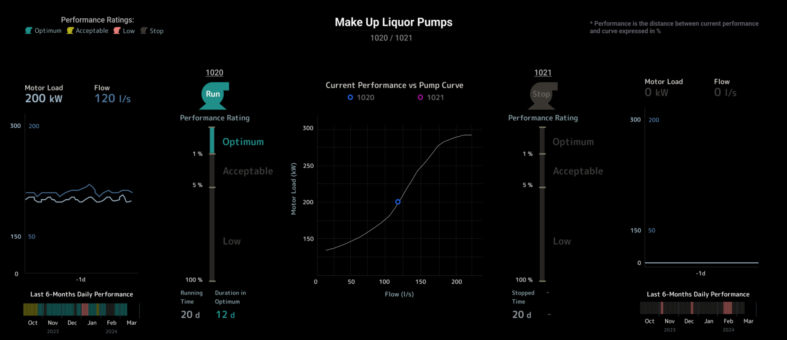
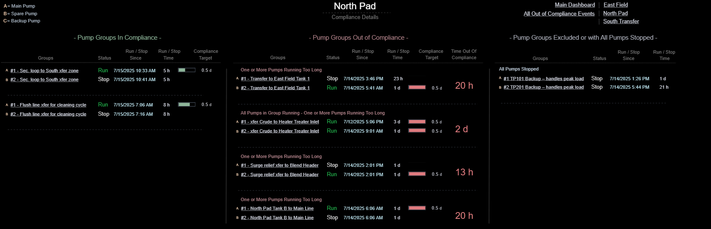
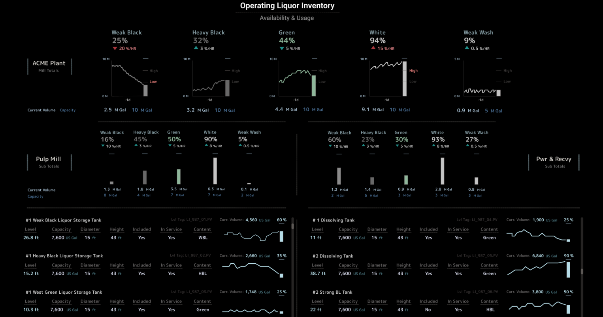
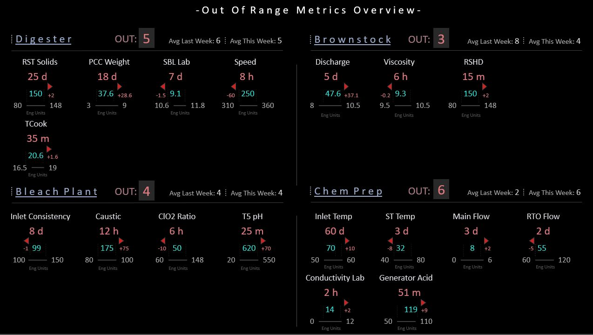
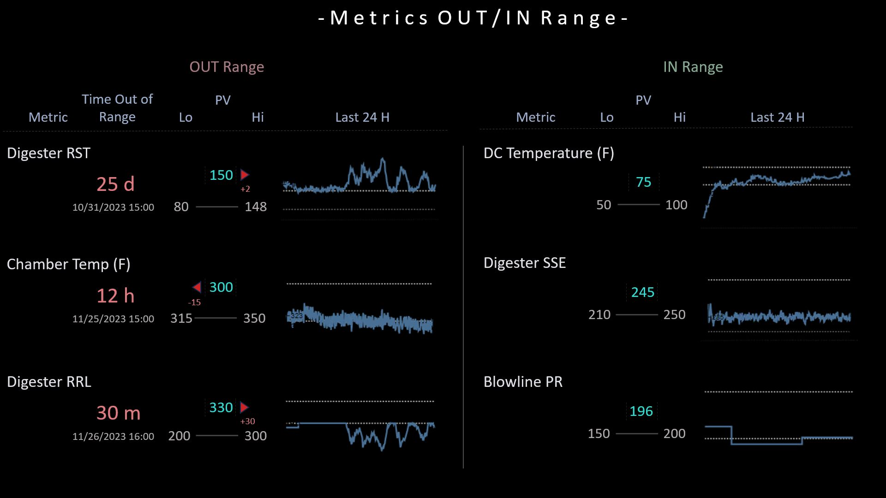

<!-- Implemented Designs Page with Card Layout and Contents Menu -->

<!-- Main Content Area -->

<!-- Header Card -->

  

    <h1 style="margin-bottom: 25px;">Implemented Designs</h1>
    
Real-world dashboards originally built for customers, recreated with simulated data to demonstrate clarity and human-centered SA design.

    
Each example applies one or more <strong>Situation Awareness (SA)</strong> principles and <strong>SA Design Patterns</strong> to show how cognitive theory translates into practical industrial visualization.

    

      Note:
    

    

      To view dashboard images in a larger format, right-click on the picture and select <em>"Open Image in New Tab."</em>
    

  

<!-- Pump Performance -->

  <h3 style="margin-bottom: 25px;">Pump Performance Dashboard</h3>
  

    Helps engineers monitor the performance of critical pumps by tracking how far current operating points deviate from the manufacturer’s pump curve — making it easier to identify underperformance early and guide corrective action.
  

  

    
  

  
Platform: AVEVA PI Vision

<!-- Pump Compliance -->

  <h3 style="margin-bottom: 25px;">Pump Compliance Tracker</h3>
  

    Shows which pumps are operating outside defined limits, for how long, and when the condition began. Designed to support reliability and maintenance teams by revealing non-compliant operation patterns across plant areas, helping prioritize follow-up actions.
  

  

    
  

  
Platform: AVEVA PI Vision

<!-- Liquor Inventory -->

  <h3 style="margin-bottom: 25px;">Liquor Inventory Summary</h3>
  

    Provides a clear, consolidated view of liquid levels across tanks — ideal for operators managing inventory across multiple vessels and ensuring sufficient availability to maintain production continuity.
  

  

    
  

  
Platform: AVEVA PI Vision

<!-- Centerlines Main -->

  <h3 style="margin-bottom: 25px;">Centerline Monitoring – Main</h3>
  

    Provides a top-level snapshot of critical process variables operating outside target ranges in a pulp and paper plant. Highlights both magnitude and duration of deviation to help teams focus attention where stability and quality are at risk.
  

  

    
  

  
Platform: AVEVA PI Vision

<!-- Centerlines Detail -->

  <h3 style="margin-bottom: 25px;">Centerline Monitoring – Detail</h3>
  

    Enables focused monitoring of process variables, showing current values alongside target limits and historical trends. Designed to help operators understand both real-time deviation and underlying process behavior.
  

  

    
  

  
Platform: AVEVA PI Vision

