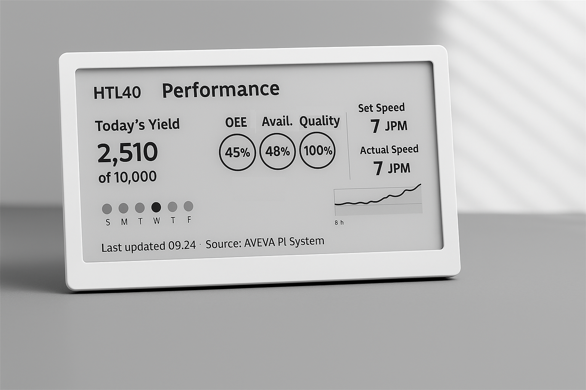

<!-- Header Card -->

  

    <h1 style="margin-bottom: 18px;">Awareness Futures</h1>
    

      As technology grows, awareness becomes shared — between humans, machines, and environments. 
      This page collects early initiatives exploring how Situation Awareness can be extended — from ambient displays to adaptive AI agents and hybrid awareness systems.
    

  

<!-- Ambience Awareness (E-Ink Concept) Card -->

  
  <h3 style="margin-bottom: 12px;">
    <a href="#sec-ambience-awareness" style="text-decoration: none; color: inherit;">🌥️ Ambience Awareness — E-Ink Display Concept</a>
  </h3>

  
<strong>Intent:</strong> Enable managers, engineers, and operators to stay informed without distraction — remaining focused on someone's day-to-day- job while keeping awareness of what’s happening in the process.

  

    <strong>Principle Alignment:</strong> Support Global SA (big-picture at a glance) · Present Level 2 Information Directly (comprehension) · Minimize Attentional Demand.
  

  

    Inspired by devices like the <strong>TRMNL e-ink dedicated information display</strong>, this concept explores a quiet, always-visible interface that <strong>informs without interrupting or distracting</strong>. It reminds you of what’s important — the selected pieces of information that help you stay oriented — while removing the noise that floods typical digital screens from phones or workstations. 
  

  

    Unlike a live dashboard, it doesn’t demand constant attention or input. It’s <strong>simple</strong> — doing one thing well: displaying meaningful process context at a glance. The device has no touchscreen; interaction is minimal by design. The display itself becomes a passive window into awareness, <strong>not an interface competing for attention</strong>.
  

  <!-- Image / Figure -->
  

    <figure style="width:70%; max-width: 820px; margin:0 auto; text-align:center;">
      
      <figcaption style="font-size:0.75em; color:#999; margin-top:6px;">Concept image generated by ChatGPT, inspired by the TRMNL e-ink information display (usetrmnl.com).</figcaption>
    </figure>
  

  <!-- Design notes -->
  <h4 style="margin-top: 18px; margin-bottom: 10px;">Design notes</h4>
  <ul style="margin-left: 20px; line-height: 1.6;">
    <li><strong>Cadence:</strong> Updates on a cadence (e.g., every 5 min), avoiding unnecessary visual change.</li>
    <li><strong>Contrast first:</strong> Typography, whitespace, and simple glyphs — no gradients or animation.</li>
    <li><strong>Focus:</strong> Display only essential context. It’s for <em>presence</em>, not control.</li>
    <li><strong>Network/Power:</strong> Minimal hardware; all logic in a central server. Battery duration in months.</li>
    <li><strong>Placement:</strong> Eye-level in team zones, control areas, management desktops, or line-side walls — visible yet not distracting.</li>
  </ul>

  <!-- Imagine if -->
  

    <strong>→ Imagine a quiet wall-mounted process display like this, keeping awareness alive without demanding dedicated attention — an ambient awareness layer for industrial spaces.</strong>
  

  <!-- Contact note -->
  

    If you’re interested in exploring the concept of an <strong>ambient process awareness display</strong> for your environment, feel free to <a href="mailto:abel.padilla@clearpicturesa.com" style="color:#1a73e8; text-decoration: underline;">get in touch</a> to discuss possibilities or pilot ideas. 
  

