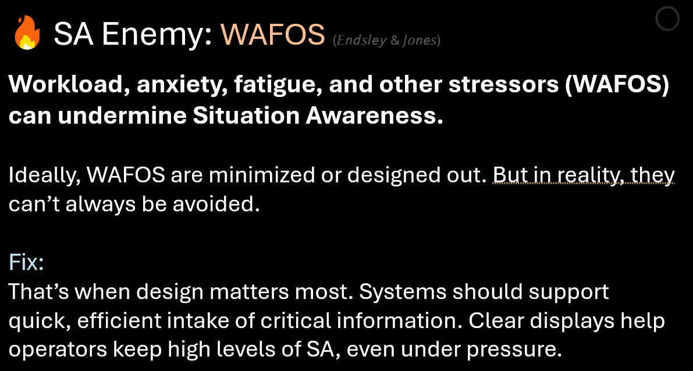

<!-- SA Enemies Page with Card Layout and Contents Menu -->

<!-- Main Content Area -->

<!-- Header Card -->

  

    <h1 style="margin-bottom: 25px;">SA Enemies</h1>
    
Common traps that chip away at Situation Awareness (SA). Each card names the pitfall and offers a simple fix to keep attention, comprehension, and projection intact.

  

<!-- Apparent Complexity -->

  <h3 style="margin-bottom: 25px;">SA Enemy: Apparent Complexity</h3>
  
A system may be complex — but its display doesn’t have to be. Apparent complexity arises from how information is presented, not how complex the system actually is.

  

    
  

<!-- Attentional Tunneling -->

  <h3 style="margin-bottom: 25px;">SA Enemy: Attentional Tunneling</h3>
  
Locking onto one element of a situation and losing awareness of the rest can cause operators to miss critical cues. Keep at least a high-level overview visible to avoid tunnel vision.

  

    
  

<!-- Creating Distraction -->

  <h3 style="margin-bottom: 25px;">SA Enemy: Creating Distraction</h3>
  
Overuse of motion, brightness, or color can make everything compete for attention — the “Las Vegas strip” effect. Use salience sparingly to draw attention only where it’s needed.

  

    
  

<!-- Data Overload -->

  <h3 style="margin-bottom: 25px;">SA Enemy: Data Overload</h3>
  
The brain has limited capacity for sensory and information processing. When too much data arrives too fast, awareness can lag. Visual organization and pacing help maintain clarity.

  

    
  

<!-- Seeing Through the Wrong Lens -->

  <h3 style="margin-bottom: 25px;">SA Enemy: Seeing Through the Wrong Lens</h3>
  
When automation or system behavior changes but users don’t realize it, they act on the wrong mental model. Mode clarity prevents users from following outdated assumptions.

  

    
  

<!-- Short Term Memory Overload -->

  <h3 style="margin-bottom: 25px;">SA Enemy: Short-Term Memory Overload</h3>
  
When users must remember and mentally connect information scattered across screens, comprehension drops. Bring related data together so understanding happens on the display — not in the mind.

  

    
  

<!-- Unaware of What Automation is Doing -->

  <h3 style="margin-bottom: 25px;">SA Enemy: Unaware of What Automation is Doing</h3>
  
Automation can lighten workload but also take users out of the loop. Interfaces must reveal the automation’s goals, actions, and status to maintain trust and understanding.

  

    
  

<!-- WAFOS -->

  <h3 style="margin-bottom: 25px;">SA Enemy: WAFOS</h3>
  
Workload, anxiety, fatigue, and other stressors (WAFOS) erode awareness. Clear displays support rapid intake of essential information — even under high stress or workload.

  

    
  

<!-- Footer -->

  Explore how these pitfalls connect to <a href="../sa-principles/index" style="text-decoration: none;">SA Concepts</a> and <a href="../sa-design-patterns/index" style="text-decoration: none;">SA Design Patterns</a> throughout the Framework.

