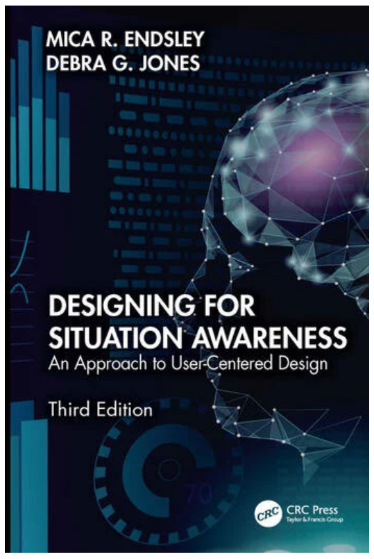
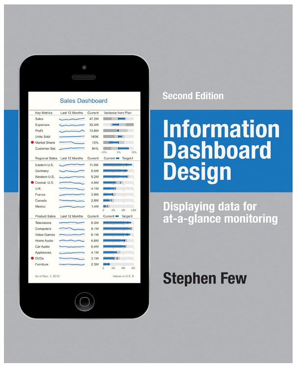
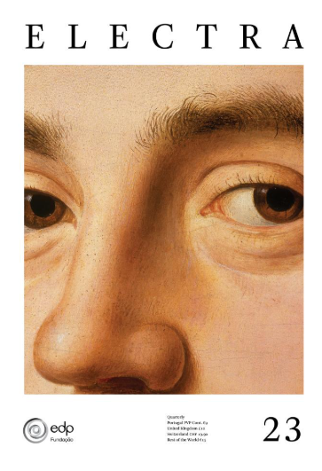

# References

This framework is inspired by a range of works on Situation Awareness (SA), interface design, and data visualization. Some are directly cited, others have shaped our thinking more generally. Full content is not reproduced here, but key insights and interpretations are reflected throughout the framework.

  
  
Designing for Situation Awareness

  
Mica R. Endsley (3rd Ed.)

  
The foundational reference behind the framework’s principles. Widely used in aviation, healthcare, and defense to improve decision-making under pressure.

  
  
Information Dashboard Design

  
Stephen Few (2nd Ed.)

  
Focuses on visual clarity for at-a-glance monitoring. Valuable for layout and formatting fundamentals aligned with real-time decision making.

  
  
Electra Magazine No. 23

  
Fundação EDP

  
An artistic and cultural journal exploring perception, cognition, and systems. Inspired our tone and perspective on industrial design as a form of communication.

