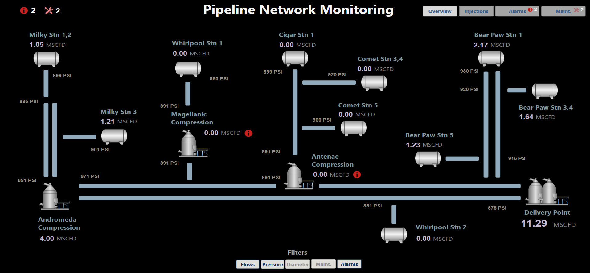
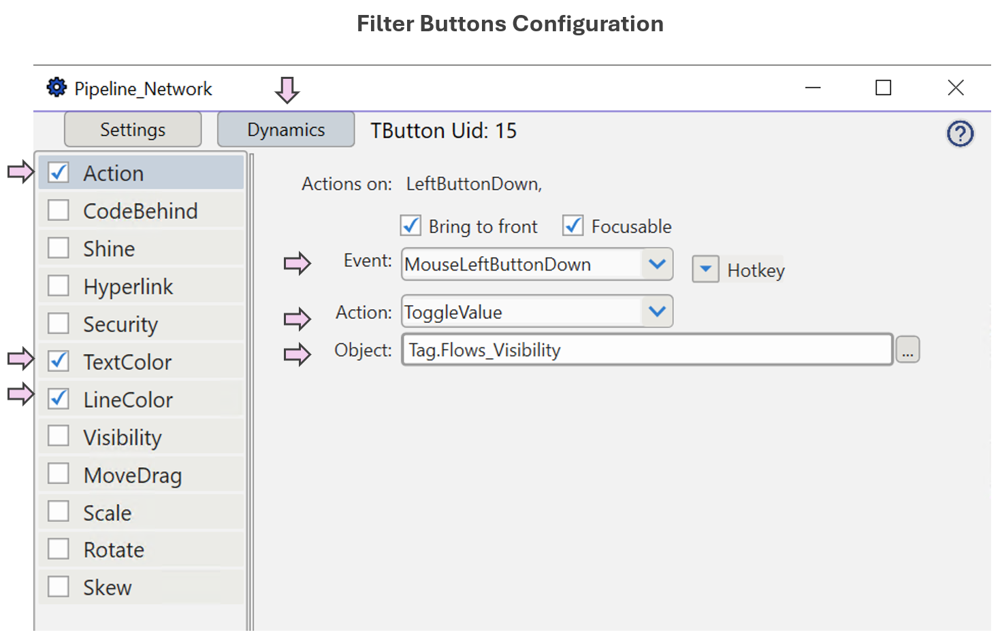
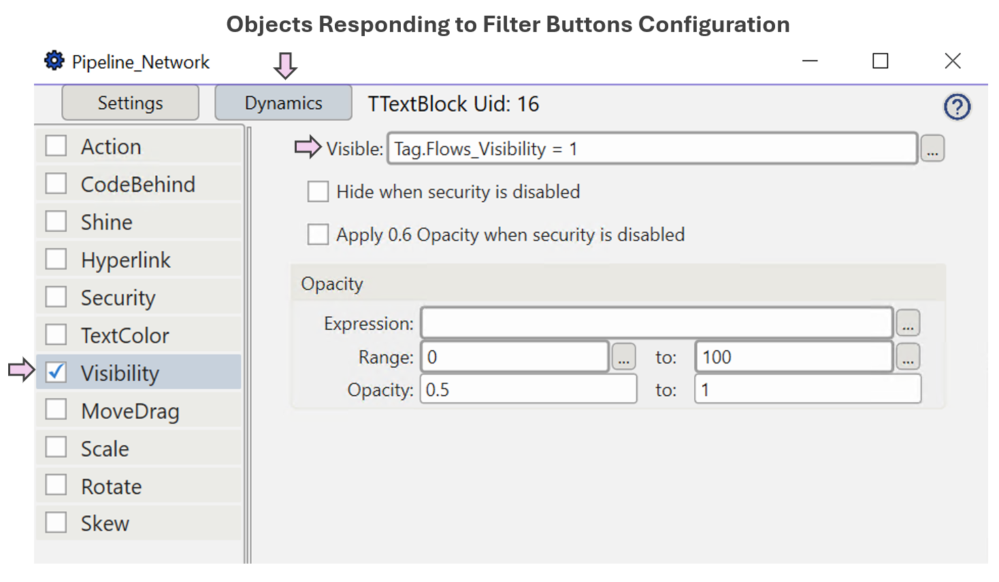
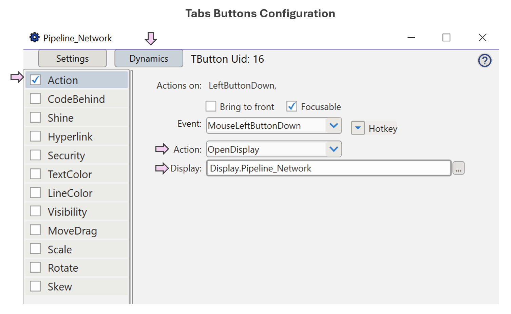

<!-- Header Card -->

  

    <h1 style="margin-bottom:20px;">User-Driven & Flexible Displays</h1>
    

      Based on Endsley & Jones’ <em>Designing for Situation Awareness: An Approach to User-Centered Design</em>,
      this pattern emphasizes giving operators <strong>control over what information is displayed</strong>, while
      ensuring displays adapt fluidly to changing goal priorities.
    

        

      Note:
    

    

      To view dashboard images in a larger format, right-click on the picture and select <em>"Open Image in New Tab."</em>
    

  

<!-- What This Pattern Is -->

  

    <h3 style="margin-bottom:20px;">What This Pattern Is</h3>
    

      This design pattern organizes information <strong>around operator goals</strong>. It uses tabs and filters so
      that users can quickly switch focus without losing situational context. Instead of overwhelming operators with
      everything at once, the display provides functionality to show the right level of detail.
    

    <ul style="max-width:none;">
      <li>High-level summaries remain visible at all times (top left) <strong>to help operators know when to shift goals</strong>.</li>
      <li>Filter buttons <strong>selectively reveal or hide information based on current goals and activities</strong>.</li>
      <li>Tabs enable users to <strong>switch views (and goals) quickly</strong>, keeping the user in control of their flow.</li>
    </ul>
  

<!-- Benefits -->

  

    <h3 style="margin-bottom:20px;">Benefits</h3>
    <ul style="max-width:none;">
      <li><strong>Keeps operators in control</strong> — users decide what information to view, rather than being forced into a fixed layout.</li>
      <li><strong>Reduces overload</strong> — filters and tabs allow hiding less relevant details so attention stays on what matters.</li>
      <li><strong>Supports changing priorities</strong> — displays adapt quickly when focus shifts, without disrupting ongoing tasks.</li>
      <li><strong>Improves efficiency</strong> — navigation is faster and less error-prone when information can be surfaced in just one or two steps.</li>
    </ul>
  

<!-- Pattern Demonstration -->

<h3 style="margin-bottom:20px;">Pattern Demonstration</h3>

The following demonstration illustrates this pattern applied to a <strong>pipeline network monitoring dashboard</strong>.
The display integrates filters, high-level summaries, and drill-down options that let operators adapt views without
losing overall context.

<h4>🎥 Demonstration Video</h4>
<video controls style="max-width:100%;height:auto;">
  <source src="../videos/ds1_demo_video.mp4" type="video/mp4">
  Your browser does not support the video tag.
</video>

<h4 style="margin-top:25px;">📷 Dashboard Views</h4>
<ul style="list-style:none;padding-left:0;max-width:none;">
  <li><strong>Base View:</strong> All filters off — global picture visible. 
    
  </li>
  <li style="margin-top:25px;"><strong>Focused View:</strong> Showing only flows, pressures, and alarms — supporting impact-on-alarms analysis. 
    
  </li>
  <li style="margin-top:25px;"><strong>Key Elements Configuration</strong> 
    
    
    
  </li>
</ul>

<!-- Reference -->

  

    

      <em>Reference:</em> Mica R. Endsley & Debra G. Jones, <strong>Designing for Situation Awareness: An Approach to User-Centered Design</strong>.
      Pattern adapted for demonstration in Clear Picture SA.
    

  

