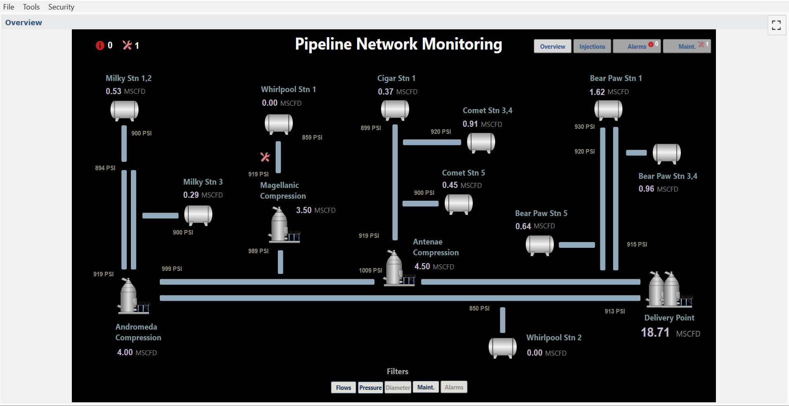
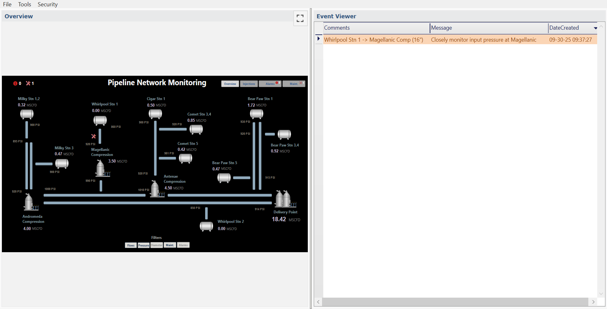
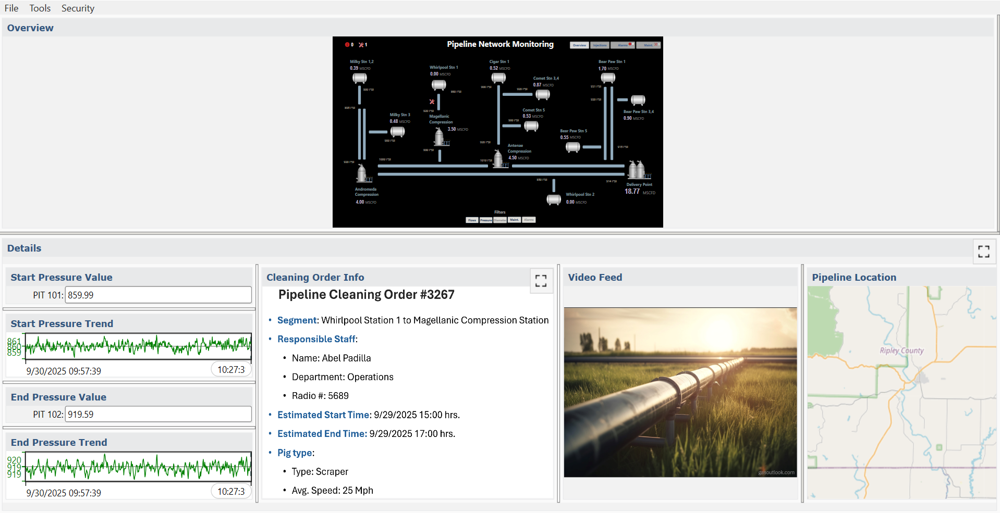
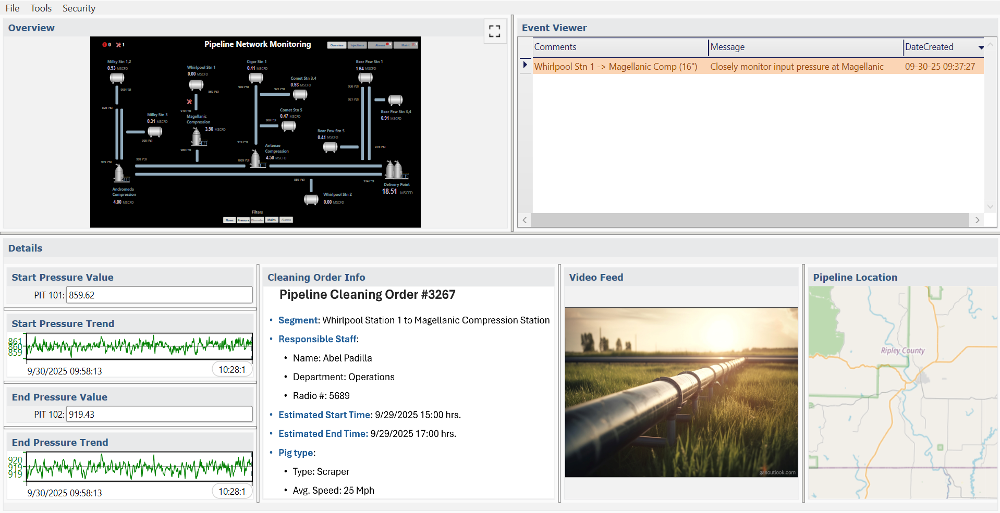
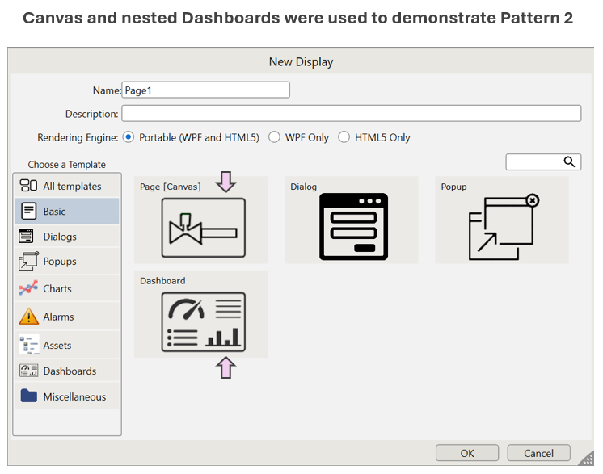
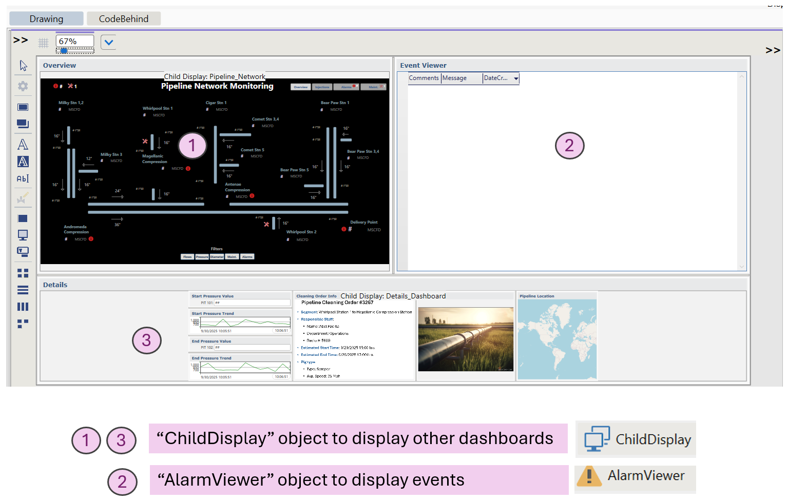

<!-- Header Card -->

  

    <h1 style="margin-bottom:20px;">High-Level Overview & Drill-Down</h1>
    

      Based on Endsley & Jones’ <em>Designing for Situation Awareness: An Approach to User-Centered Design</em>,
      this pattern emphasizes keeping a <strong>high-level picture always visible</strong>, while enabling operators
      to drill down into details only when needed.
    

        

        

      Note:
    

    

      To view dashboard images in a larger format, right-click on the picture and select <em>"Open Image in New Tab."</em>
    

  

<!-- What This Pattern Is -->

  

    <h3 style="margin-bottom:20px;">What This Pattern Is</h3>
    

      This design pattern balances <strong>overview and detail</strong>. Operators maintain global SA from a central display,
      but can open contextual panes or detail views when more information is required. This prevents clutter while keeping
      high-level status always in sight.
    

    <ul style="max-width:none;">
      <li>The <strong>overview map/dashboard</strong> shows system-wide state at a glance.</li>
      <li>Clicking or selecting elements opens <strong>detail panes</strong> (e.g., trends, task info, video feeds) only when needed.</li>
      <li>Operators can <strong>prioritize attention</strong> by filtering or drilling down without losing context of the big picture.</li>
    </ul>
  

<!-- Benefits -->

  

    <h3 style="margin-bottom:20px;">Benefits</h3>
    <ul style="max-width:none;">
      <li><strong>Supports global SA</strong> — operators always keep sight of the system overview.</li>
      <li><strong>Minimizes clutter</strong> — details only appear when requested, reducing visual overload.</li>
      <li><strong>Enhances comprehension</strong> — details are linked directly to overview elements, supporting Level 2 SA (understanding).</li>
      <li><strong>Improves response</strong> — operators can dive deeper without breaking context, reducing time to act.</li>
    </ul>
  

<!-- Pattern Demonstration -->

<h3 style="margin-bottom:20px;">Pattern Demonstration</h3>

The following demonstration illustrates this pattern applied to a <strong>pipeline network monitoring dashboard</strong>.
Operators view a high-level map of the system, while detail panes (trends, alarms, tasks, video feeds) appear only when needed — keeping global SA intact.

<h4>🎥 Demonstration Video</h4>
<video controls style="max-width:100%;height:auto;">
  <source src="../videos/ds2_demo_video.mp4" type="video/mp4">
  Your browser does not support the video tag.
</video>

  <em>Silent demo — visuals only</em>

<h4 style="margin-top:25px;">📷 Dashboard Views</h4>
<ul style="list-style:none;padding-left:0;max-width:none;">
  <li><strong>Overview:</strong> System-wide state always visible. This supports global Situation Awareness. 
    
  </li>

  <li style="margin-top:25px;"><strong>Event-Linked Pane:</strong> Event viewer opens alongside the overview. In this example, the operator reviews high-level information about a maintenance event highlighted on the map. 
    
  </li>

  <li style="margin-top:25px;"><strong>Rich Detail View:</strong> Drill-down adds trends, work orders, video, and maps. The operator can expand awareness of the maintenance event when deeper context is needed. 
    
  </li>

  <li style="margin-top:25px;"><strong>Configured Full Drill-Down:</strong> All panes expanded. The operator can view overview, high-level, and detailed information simultaneously to support decision-making. 
    
  </li>

  <li style="margin-top:25px;"><strong>Key Panes Configuration:</strong> The dashboard is composed of multiple building blocks. The overview drawing was created in a <em>Canvas</em> display, while separate <em>Dashboard</em> displays hold the Events Table and the Details Pane. A third dashboard integrates them into a single view. 
    
    
  </li>
</ul>

<!-- Implementation Notes -->

  

    <h3 style="margin-bottom:15px;">Implementation Notes</h3>
    <ul style="max-width:none;">
      <li>The demonstration dashboard did not include functionality to click on the maintenance icon and automatically sync content across all other panes (Event Viewer, Details). Implementing this would require additional development, as seen in the Tatsoft Demo project. For Design Pattern illustration purposes, this functionality was not deemed necessary.</li>
      <li>In the <em>Details</em> pane, the "Video Feed" is represented by a static image. Completing this would require further configuration, but was not necessary to demonstrate the concept of this Design Pattern.</li>
    </ul>
  

<!-- Reference -->

  

    

      <em>Reference:</em> Mica R. Endsley & Debra G. Jones, <strong>Designing for Situation Awareness: An Approach to User-Centered Design</strong>.
      Pattern adapted for demonstration in Clear Picture SA.
    

  

