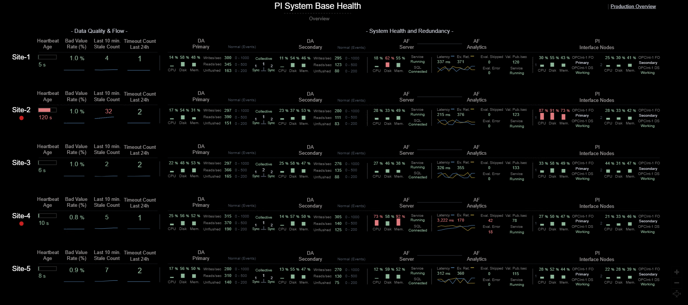
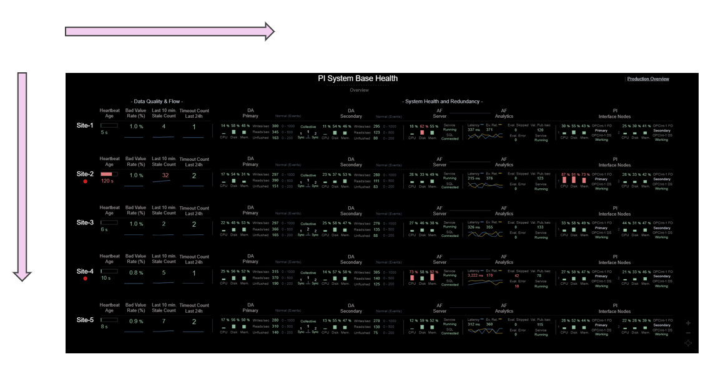
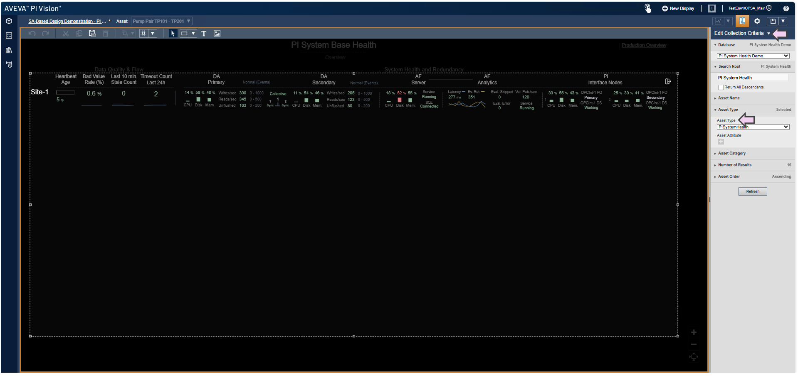

<!-- Header Card -->

<h1 style="margin-bottom:20px;">Multi-Asset Overview Pattern</h1>

A design pattern for presenting <strong>multiple assets on a single screen</strong> to support rapid 
perception, comparison, and anomaly detection. This layout minimizes display complexity,
reduces search cost, and strengthens all three levels of Situation Awareness by structuring 
information consistently across assets.

    

        

      Note:
    

    

      To view dashboard video/images in a larger format, right-click on the picture and select <em>"Open Image in New Tab."</em>
    

<!-- What This Pattern Is -->

<h3 style="margin-bottom:20px;">What This Pattern Is</h3>

This pattern displays <strong>one row per asset</strong>, allowing system administrators to quickly understand
the condition of a single asset (horizontal scanning) and compare a specific metric across
all assets (vertical scanning).

<ul style="max-width:none;">
<li><strong>Asset rows</strong> group indicators by operational meaning (Data Flow, Archive Health, Analytics, Interfaces, etc.).</li>
<li><strong>Horizontal scanning</strong> provides a complete snapshot of one asset at a glance.</li>
<li><strong>Vertical scanning</strong> reveals outliers and comparative differences immediately.</li>
<li><strong>Goal-oriented grouping</strong> reduces search effort and speeds comprehension.</li>
<li>Consistent color cues and trends make <strong>normal vs. abnormal</strong> states immediately perceptible.</li>
</ul>

<!-- Why This Pattern Matters -->

<h3 style="margin-bottom:20px;">Why This Pattern Matters</h3>

Monitoring multiple assets often requires switching across displays, tabs, or systems — 
fragmenting attention and increasing cognitive load.  
This pattern solves that by consolidating all critical indicators into <strong>a single pane</strong>.

<ul style="max-width:none;">
<li><strong>Reduces display complexity</strong> (Few) by keeping everything visible at once, eliminating multi-window navigation.</li>
<li><strong>Minimizes search cost</strong> (Endsley) through predictable left-to-right and top-to-bottom information flow.</li>
<li><strong>Supports Level 1 SA</strong> via clear color coding, easy follow layout, and reduced visual noise.</li>
<li><strong>Supports Level 2 SA</strong> by visually linking components (DA, AF, Interfaces) to form a coherent operational model.</li>
<li><strong>Supports Level 3 SA</strong> through small trends that reveal developing issues and temporal patterns.</li>
</ul>

The result is faster detection of anomalies, improved comprehension of system state, and better projection of future conditions.

<!-- Pattern Demonstration -->

<h3 style="margin-bottom:20px;">Pattern Demonstration</h3>

Below is a demonstration of this pattern applied to <strong>multiple PI Systems</strong>.  
PI Systems in this example act as a stand-in for any repeated asset type.

<h4>🎥 Demonstration Video</h4>
<video controls style="max-width:100%;height:auto;">
  <source src="../videos/ds3_demo_video.mp4" type="video/mp4">
  Your browser does not support the video tag.
</video>

<h4 style="margin-top:25px;">📷 Dashboard Views</h4>
<ul style="list-style:none;padding-left:0;max-width:none;">
  <li><strong>One Screen:</strong> A single pane showing performance of all assets for at-a-glance Situation Awareness. 
    
  </li>

  <li style="margin-top:25px;"><strong>Arrangement of Information:</strong> Display complexity is reduced through left-to-right
      goal-aligned ordering and top-to-bottom asset alignment for easy comparisons. 
    
  </li>

  <li style="margin-top:15px;">
    <strong>Key Components Monitored:</strong>
    <ul>
      <li><strong>Data Quality & Flow</strong> — heartbeat, stale count, bad value rate.</li>
      <li><strong>Data Archive</strong> — CPU, disk, memory, writes/reads/sec, unflushed events.</li>
      <li><strong>AF Server</strong> — CPU, memory, service status.</li>
      <li><strong>AF Analytics</strong> — latency, evals/sec, errors, skipped counts.</li>
      <li><strong>PI Interfaces</strong> — node health, failover state, connection status.</li>
    </ul>
  </li>

  <li style="margin-top:40px;"><strong>Key Configuration:</strong> The dashboard uses <em>Collections</em> for dynamic 
      multi-asset rendering, along with <em>Multi-State</em> and <em>Blink</em> rules for alarm conditions. 
    
  </li>
</ul>

<!-- Implementation Notes -->

<h3 style="margin-bottom:15px;">Implementation Notes</h3>
<ul style="max-width:none;">
<li>The pattern scales naturally by adding new rows for new assets.</li>
<li>Trends remain intentionally minimal to avoid clutter while enabling projection.</li>
<li>Ranges and thresholds should appear directly on screen to avoid memory load.</li>
<li>Alarm treatment must remain visually consistent across all assets.</li>
<li>While demonstrated using PI Systems, this pattern applies to any repeated asset type.</li>
</ul>

<!-- Reference -->

<em>References:</em> 
Stephen Few — <strong>Information Dashboard Design</strong> 
Mica R. Endsley & Debra G. Jones — <strong>Designing for Situation Awareness</strong> 
Pattern demonstrated within the Clear Picture SA framework.

