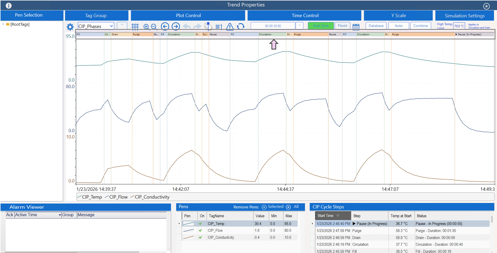
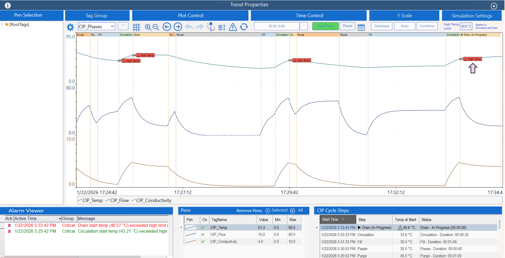
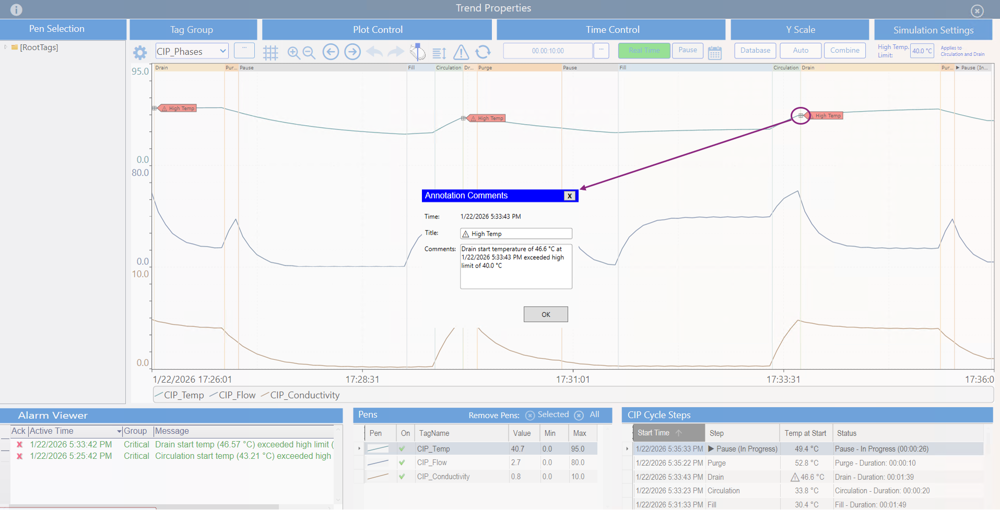

<!-- Header Card -->

  

    <h1 style="margin-bottom:20px;">Embed Information in Context</h1>
    

      Based on Endsley &amp; Jones’ <em>Designing for Situation Awareness: An Approach to User-Centered Design</em>,
      this pattern emphasizes <strong>embedding supporting information directly within the primary display</strong>,
      so critical relationships can be perceived immediately without mental reconstruction.
    

    

      Note:
    

    

      To view dashboard images in a larger format, right-click on the picture and select <em>"Open Image in New Tab."</em>
    

  

<!-- What This Pattern Is -->

  

    <h3 style="margin-bottom:20px;">What This Pattern Is</h3>
    

      This design pattern focuses on <strong>making context visible at the point of use</strong>.
      Instead of separating process data, events, and diagnostics into different views,
      supporting information is embedded directly into the primary visualization where decisions are made.
    

    <ul style="max-width:none;">
      <li>Process states, events, or phases are shown <strong>in-line</strong> with time-series data.</li>
      <li>Diagnostic meaning (limits, violations, annotations) is displayed <strong>where the data occurs</strong>.</li>
      <li>Operators can immediately understand <strong>what happened, when it happened, and why it matters</strong>.</li>
    </ul>
  

<!-- Benefits -->

  

    <h3 style="margin-bottom:20px;">Benefits</h3>
    <ul style="max-width:none;">
      <li><strong>Reduces cognitive effort</strong> — operators no longer need to mentally align trends, events, and limits.</li>
      <li><strong>Improves comprehension</strong> — relationships between process behavior and system state are immediately visible.</li>
      <li><strong>Supports projection</strong> — embedded context helps users anticipate consequences and outcomes.</li>
      <li><strong>Accelerates diagnosis</strong> — abnormal conditions are recognized faster because meaning is shown in place.</li>
    </ul>
  

<!-- Pattern Demonstration -->

<h3 style="margin-bottom:20px;">Pattern Demonstration</h3>

The following demonstration applies this pattern to <strong>Clean-In-Place (CIP) analysis</strong>.
Traditional trends show process variables in isolation.
This design embeds <strong>CIP step transitions</strong> and <strong>diagnostic annotations</strong> directly into the trend,
providing immediate operational context.

<h4>🎥 Demonstration Video</h4>
<video controls style="max-width:100%;height:auto;">
  <source src="../videos/ds4_demo_video.mp4" type="video/mp4">
  Your browser does not support the video tag.
</video>

  <em>Silent demo — visuals only</em>

<h4 style="margin-top:25px;">📷 Dashboard Views</h4>
<ul style="list-style:none;padding-left:0;max-width:none;">
  <li><strong>CIP Phase Transitions:</strong> Step changes (Fill, Circulation, Drain, Purge, Pause) are rendered directly on the trend timeline, allowing operators to see exact transition points without referencing tables or reports. 
    
  </li>

  <li style="margin-top:25px;"><strong>Embedded Diagnostic Annotations:</strong> High-temperature conditions at the start of Circulation and Drain are annotated directly on the trend, eliminating the need to infer violations from raw values or search alarm lists. 
    
  </li>

  <li style="margin-top:25px;"><strong>Meaning at the Moment of Occurrence:</strong> Selecting an annotation reveals why the condition matters (e.g., start temperature exceeded limit), tightly coupling data, event, and interpretation in a single view. 
    
  </li>
</ul>

<!-- Implementation Notes -->

  

    <h3 style="margin-bottom:15px;">Implementation Notes</h3>
    <ul style="max-width:none;">
      <li>CIP phase transitions were generated as range annotation events and rendered directly in the trend to eliminate time-alignment effort.</li>
      <li>High-temperature conditions were embedded as annotations instead of relying solely on alarms or external reports.</li>
      <li>The design prioritizes <em>perceptual clarity</em> over interaction complexity — no drill-down is required to understand what occurred.</li>
    </ul>
  

<!-- Reference -->

  

    

      <em>Reference:</em> Mica R. Endsley &amp; Debra G. Jones, <strong>Designing for Situation Awareness: An Approach to User-Centered Design</strong>.
      Design Schema 7 — Embed Supporting Information in Context.
    

  

