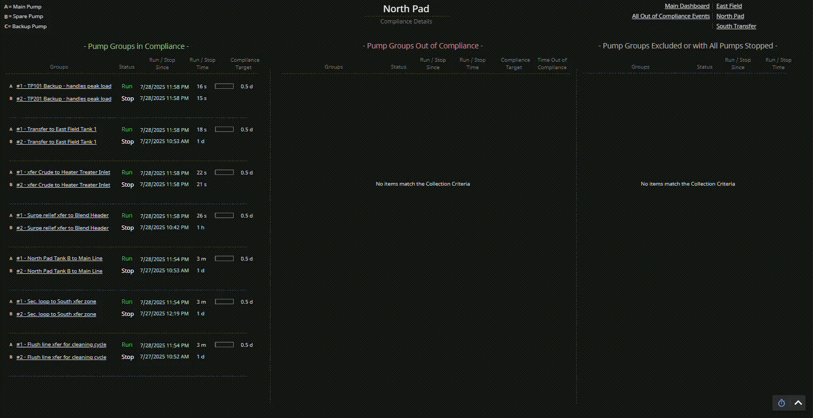
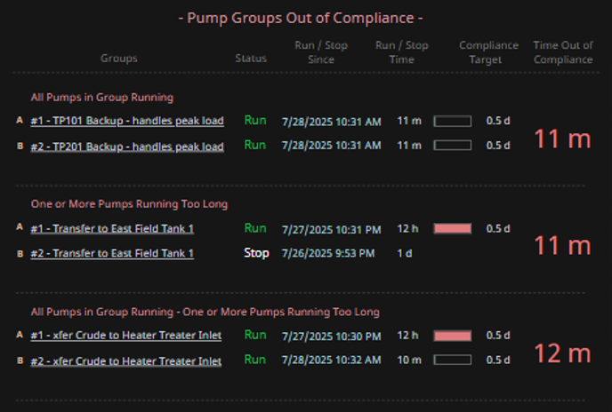
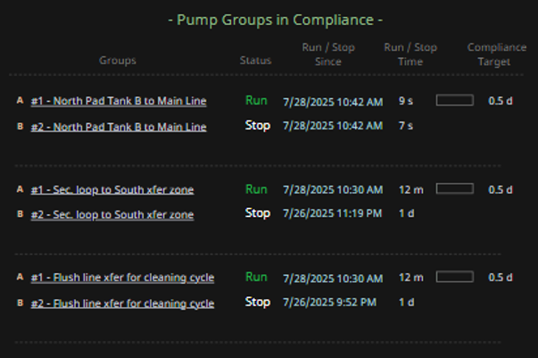
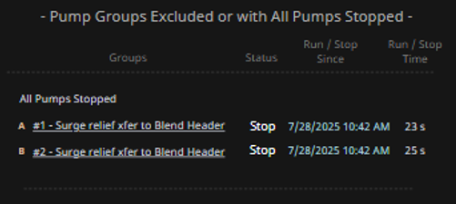
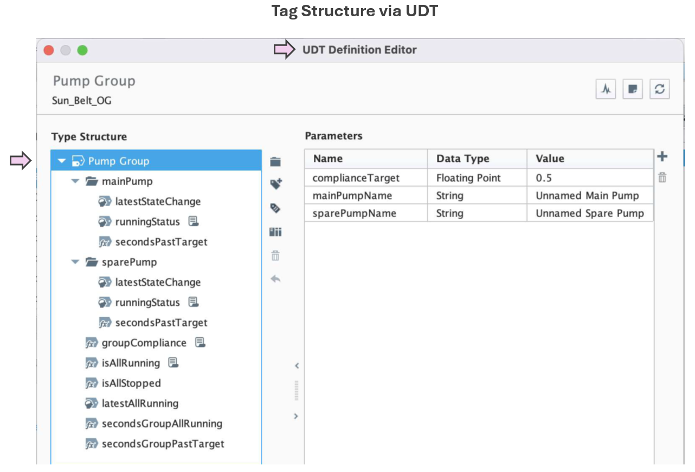
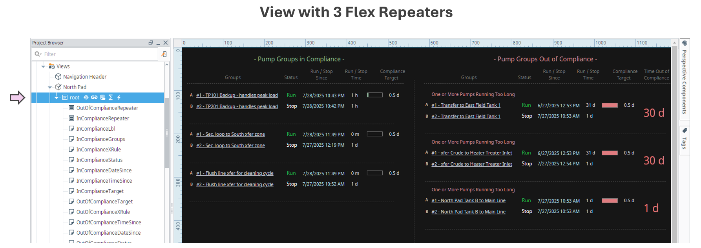
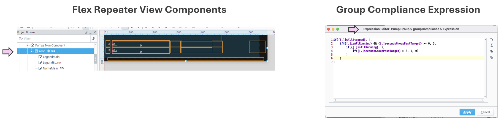

  
  

    Supports Comprehension
  

### Why It Matters

> **Classification** (formerly “Chunking” in this framework) helps users make sense of many data points by grouping them into meaningful categories.

- Operators often face many signals in very little time.
- Without clear categorization, working memory gets overwhelmed.
- Classification improves cognitive efficiency by visually organizing data into recognizable groups.

### Operational Impact Examples

- **Reliability meeting dashboards:**  
  Categorizing out-of-compliance assets helps teams focus discussion and plan actions quickly.

- **Pump monitoring during shift change:**  
  Instead of scanning each pump, operators can review categories like “Running Too Long” or “All Stopped” to grasp the situation instantly.

- **Alarm review displays:**  
  Classifying alarms by source system (instrumentation, electrical) or likely root cause (flow blockage, power loss) speeds analysis and response.

> Classification bridges perception and action — enabling users to see what matters without assembling the puzzle mentally.

### Cross-Domain Analogy

> **Air Traffic Control:**  
> Experienced controllers don’t track 30 individual planes in isolation — they classify them into meaningful sets like “arrivals,” “departures,” or “holding pattern.” This makes complexity manageable and improves decisions.

  

### Typical Design Techniques

- **Section headings and labels:** Visually separate related items using titles, lines, or padding.
- **Color-coded categories:** Use consistent colors to bind items conceptually.
- **Whitespace and alignment:** Leverage layout to form natural group boundaries.
- **Spatial repositioning:** Move items between categories only when it aids comprehension.

The platform testing section below shows examples of these techniques in practice.

### Use Case for Platform Testing

Consider a compliance tracking dashboard for pump groups:

  - Visually organize pump groups into three distinct categories:
    **In Compliance**, **Out of Compliance**, and **Excluded or Fully Stopped**.
  - Use **spatial layout** (e.g., three columns) to create clear visual categories.
  - Apply consistent spacing and alignment within each category to reinforce classification.
  - Evaluate how easily users can **identify which pump groups need attention**, rather than mentally scanning all pumps at once — especially during early-morning reliability meetings when cognitive load is high.

### Tested Platforms

#### ✅ AVEVA PI Vision — Supports Classification

| Aspect | Notes |
| ------ | ----- |
| **Implementation Approach** | Visual categorization handled via analytics-driven tag logic and grouped containers. |
| **Display Build** | • Utilized Collections to categorize pump groups by compliance status • Timers, timestamps and time accumulations enhance comprehension of compliance state |
| **Version Tested** | PI Vision 2024. PI Server 2018 SP3 |

  
  

    To view the animation in a larger, more legible format, right-click on the GIF and select <em>"Open Image in New Tab"</em>.
  

  
  
  
  
  

#### ✅ Ignition Perspective — Supports Classification

| Aspect | Notes |
| ------ | ----- |
| **Implementation Approach** | Pump groups are modeled using UDTs and organized dynamically by compliance status. Categorization logic is handled via tag-driven rules and scripting within Flex Repeaters. |
| **Display Build** | • Three clearly separated columns show compliant, out-of-compliance, and stopped pump groups • Each group contains dynamic runtime counters, timestamps, and compliance indicators • Layout supports at-a-glance comparison and comprehension |
| **Version Tested** | Ignition 8.1.x (Perspective) |

  
  

    To view the animation in a larger, more legible format, right-click on the GIF and select <em>"Open Image in New Tab"</em>.
  

  
  
  
  
  
  

#### Upcoming Vendor Testing

- Tatsoft FrameworX

See which platforms have been tested for each SA concept in the <a href="../platform-support/sa-vendor-listing" style="text-decoration: none;">SA Vendor Listing</a>.

