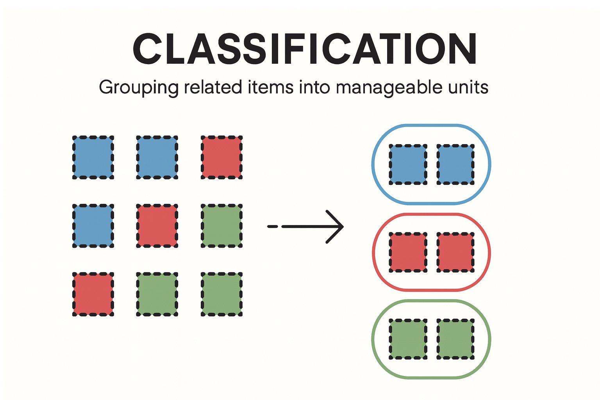

  
  

    Supports Comprehension
  

### Why It Matters

- Operators need to process many data points in a short amount of time.
- Without clear grouping or classification, working memory gets overwhelmed.
- Chunking improves cognitive efficiency by visually organizing data into meaningful units.

### Operational Impact Examples

- **Reliability meeting dashboards:**  
  Grouping out-of-compliance assets helps teams focus discussion and plan actions quickly.

- **Pump monitoring during shift change:**  
  Instead of reviewing each pump individually, operators can scan categories like “Running Too Long” or “All Stopped” to grasp the situation instantly.

- **Alarm review displays:**  
  Grouping alarms by source system (e.g., instrumentation, electrical) or likely root cause (e.g., flow blockage, power loss) makes it faster to analyze what's happening and respond appropriately.

> Chunking bridges perception and action — enabling users to see what matters without assembling the puzzle mentally.

### Real-World Analogy

> **Air Traffic Control Grouping:**  
> Experienced air traffic controllers don’t track 30 individual planes — they organize them into meaningful chunks like “arrivals,” “departures,” or “holding pattern.” This makes complexity manageable and improves control decisions.

  

### Typical Design Techniques

- **Section headings and labels:** Visually separate related items using titles, lines, or padding.
- **Color-coded groupings:** Use consistent colors to bind items conceptually.
- **Whitespace and alignment:** Leverage layout to form natural group boundaries.
- **Spatial repositioning:** Animate movement of items between groups only when it aids user comprehension.

The platform testing section below shows examples of some of these techniques in practice.

### Use Case for Platform Testing

Consider a compliance tracking dashboard for pump groups:

  - Visually organize pump groups into three distinct categories:
    **In Compliance**, **Out of Compliance**, and **Excluded or Fully Stopped**

  - Use **spatial repositioning** (e.g. column layout) to create clear visual "chunks" of pump groups based on their compliance status

  - Apply consistent spacing and alignment within each group to reinforce classification

  - Evaluate how easily users can **track the pump groups that need attention**, rather than mentally scanning all pumps at once — especially during early morning reliability meetings when cognitive load is high

### Tested Platforms

#### ✅ AVEVA PI Vision — Supports Chunking

| Aspect | Notes |
| ------ | ----- |
| **Implementation Approach** | Visual grouping handled via analytics-driven tag logic and grouped containers. |
| **Display Build** | • Utilized Collections to categorize pump groups based on compliance status • Timers, timestamps and time accumulations built to enhance comprehension of compliance situation |
| **Version Tested** | PI Vision 2024. PI Server 2018 SP3 |

  

  To view the animation in a larger, more legible format, right-click on the GIF and select <em>"Open Image in New Tab"</em>.

  
  
  
  
  

#### Upcoming Vendor Testing

- Inductive Automation Perspective
- Tatsoft FrameworX

See which platforms have been tested for each SA concept in the <a href="../platform-support/sa-vendor-listing" style="text-decoration: none;">SA Vendor Listing</a>.

