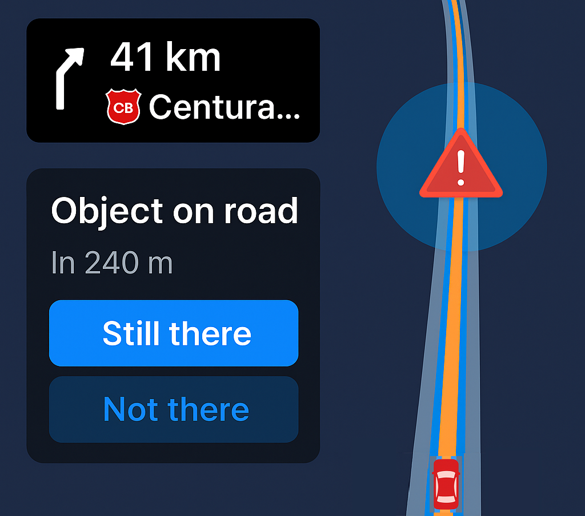
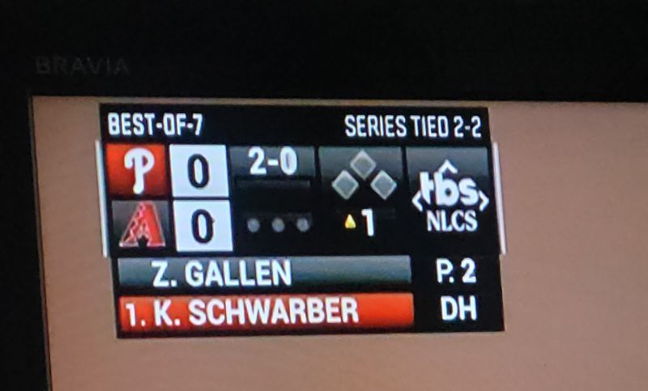
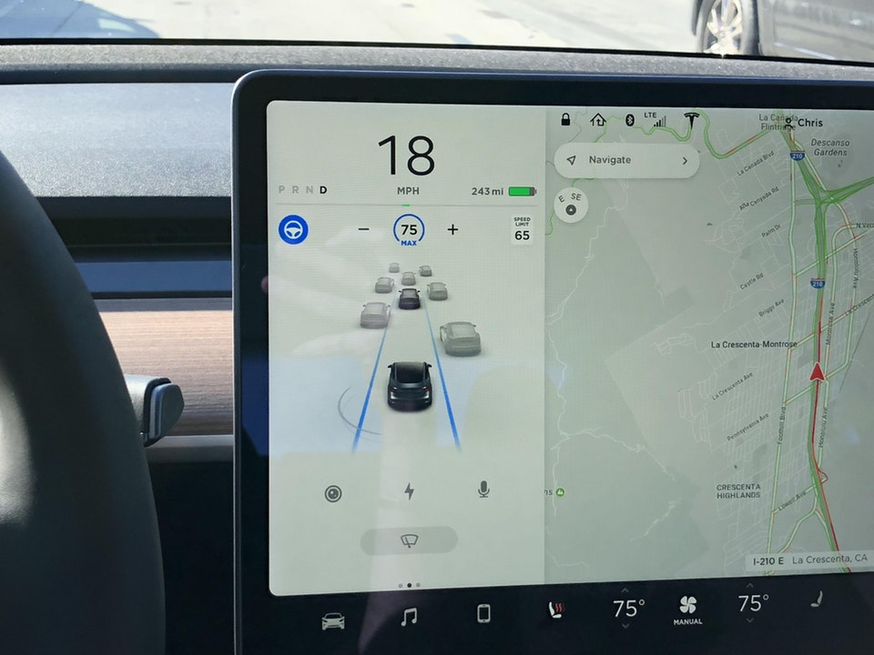
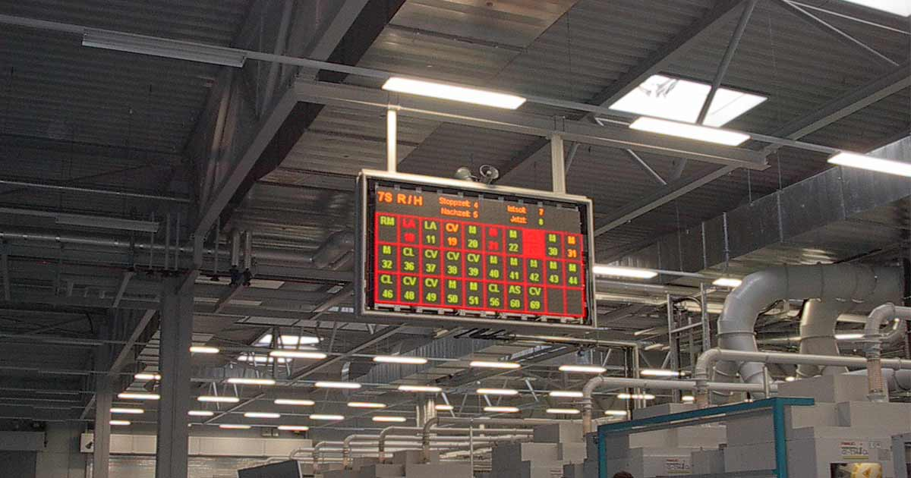

<!-- Header Card -->

  

    <h1 style="margin-bottom: 25px;">Daily Moments of SA</h1>
    
These are small, everyday interactions that illustrate key Situation Awareness principles in action. They help connect abstract SA concepts to familiar experiences.

  

<!-- 57 Minutes Until Full Card -->

  
  <h3 style="margin-bottom: 15px;">
    <a href="#sec-57-min-until-full" style="text-decoration: none; color: inherit;">📱 “57 Minutes Until Full”</a>
  </h3>
  
<strong>Principle:</strong> Present SA Level 2 Information Directly – Support Comprehension

  

    Rather than displaying voltage or just a battery percentage, the phone gives you the information that matters: 
    
    <strong>How long until full?</strong>
  

  

    <figure style="width:50%; margin:0 auto; text-align:center;">
      
      <figcaption style="font-size:0.75em; color:#999; margin-top:6px;">Image: Author’s own screenshot.</figcaption>
    </figure>
  

  

    This is Level 2 SA: Comprehension. It reduces the mental effort needed to interpret raw data and helps you plan your day quickly.
  

  

    <strong>→ Imagine if a process dashboard did the same.</strong>
  

<!-- Road Hazard Ahead Card -->

  
  <h3 style="margin-bottom: 15px;">
    <a href="#sec-road-hazard-ahead" style="text-decoration: none; color: inherit;">🚗 “Object on Road Ahead”</a>
  </h3>
  
<strong>Principle:</strong> Provide Assistance for Level 3 SA – Support Projection

  

    Modern GPS systems don’t just show your route. They warn you of possible hazards ahead — an object in the road, or even a police car reported by other drivers. 
    
    This forward-looking cue changes how you drive: you might adjust speed, watch nearby lanes, and stay alert for sudden maneuvers. If the hazard is gone, you can even update the system for others.
  

  

    <figure style="width:50%; margin:0 auto; text-align:center;">
      
      <figcaption style="font-size:0.75em; color:#999; margin-top:6px;">Image generated with ChatGPT.</figcaption>
    </figure>
  

  

    This is Level 3 SA: Projection. The display gives you a picture of what <em>might</em> happen ahead, so you can prepare before it becomes urgent.
  

  

    <strong>→ Imagine if a process dashboard did the same — alerting you to what’s likely to happen next, so you can adjust process parameters proactively and avoid reacting too late, causing issues and inefficiencies.</strong>
  

<!-- SpaceX Launch Info Card -->

  
  <h3 style="margin-bottom: 15px;">
    <a href="#sec-spacex-launch-info" style="text-decoration: none; color: inherit;">🚀 “A Clear Picture of Launch”</a>
  </h3>
  
<strong>Principle:</strong> Maintain Situational Awareness across multiple aspects of the environment 

  

    SpaceX live broadcasts demonstrate how a single display tile can keep the public oriented through every stage of a launch. Instead of raw telemetry, key metrics are always visible: <strong>speed, altitude, and mission elapsed time</strong>.
  

  

    <figure style="width:80%; margin:0 auto; text-align:center;">
      
      <figcaption style="font-size:0.75em; color:#999; margin-top:6px;">Image source: SpaceX YouTube livestream.</figcaption>
    </figure>
  

  

    A timeline highlights completed milestones (e.g., Max-Q, stage separation) and anticipates upcoming ones. Simple visuals show <strong>engine state</strong> and <strong>spacecraft orientation</strong>, while widgets adapt dynamically to the phase of the mission (such as switching to an orbital view once in space).
  

  

    
  

  
  

    <strong>
    → Imagine if industrial dashboards did the same: keeping essentials visible and adapting seamlessly as processes move through phases.
    </strong>
  

<!-- MLB Scoreboard Card -->

  
  <h3 style="margin-bottom: 15px;">
    <a href="#sec-mlb-scoreboard" style="text-decoration: none; color: inherit;">⚾ “A Clear Picture of the Game”</a>
  </h3>
  
<strong>Principle:</strong> Support Global SA – Provide the “Big Picture”

  

    While watching a Major League Baseball playoff game, notice how the scoreboard graphic tells you exactly what you need to understand the situation: 
    
    <strong>Score, base runners, balls, strikes, outs, inning, pitcher, and batter.</strong>
  

  

    <figure style="width:60%; margin:0 auto; text-align:center;">
      
      <figcaption style="font-size:0.75em; color:#999; margin-top:6px;">Image source: Screenshot from MLB television broadcast.</figcaption>
    </figure>
  

  

    Sure, there are many more statistics available (like fielder’s choice), but to engage with the game <em>right now</em>, this summary provides the global SA needed to follow the action. It discourages attentional narrowing by ensuring the essentials are always visible.
  

  
  

    <strong>→ Imagine if real-time industrial dashboards followed the same approach: providing the big-picture of the situation, while still allowing drill-down for detailed analysis when necessary.</strong>
  

<!-- Automation Explaining Itself Card -->

  
  <h3 style="margin-bottom: 15px;">
    <a href="#sec-automation-explaining-itself" style="text-decoration: none; color: inherit;">🤖 “When Automation Explains Itself”</a>
  </h3>
  
<strong>Principle:</strong> Provide Automation Transparency and Explainability

  
  

    Tesla’s Autopilot visualization gives drivers a window into what the automation “sees.” 
    Every blue line, gray car, and bounding box reveals how the system is perceiving and understanding the environment in real time.
  

  

    <figure style="width:60%; margin:0 auto; text-align:center;">
      
      <figcaption style="font-size:0.8em; color:#777; margin-top:5px;">
        Image source:
        <a href="https://www.teslarati.com/tesla-autopilot-vehicle-lane-detection-off-ramp/" target="_blank" style="color:#777; text-decoration: underline;">Teslarati</a>
      </figcaption>
    </figure>
  

  

    Instead of being a black box, the automation is <strong>expressing its awareness</strong>. 
    This helps drivers:
    <ul style="margin-left: 20px;">
      <li><strong>Verify perception:</strong> “It sees that car ahead.”</li>
      <li><strong>Comprehend behavior:</strong> “It’s braking because it detected slowing traffic.”</li>
      <li><strong>Project next actions:</strong> “It will stay centered in its lane.”</li>
    </ul>
  

  

    Automation that reveals its own SA helps humans maintain theirs — supporting trust, comprehension, and readiness to intervene. 
  

    <strong>→ Imagine if industrial AI systems showed their awareness like this — helping operators stay in the loop for shared understanding and control.</strong>
  

<!-- Andon Display Card -->

  
  <h3 style="margin-bottom: 15px;">
    <a href="#sec-andon-display" style="text-decoration: none; color: inherit;">🏭 “A Common Picture for the Team”</a>
  </h3>
  
<strong>Principle:</strong> Support Global SA – Provide the “Big Picture” for Team Operations

  

    In busy industrial environments, it’s easy for attention to narrow toward one station or one task. 
    To keep everyone aligned, teams rely on displays that maintain a shared mental picture of the whole process.
  

  

    <figure style="width:70%; margin:0 auto; text-align:center;">
      
      <figcaption style="font-size:0.75em; color:#999; margin-top:6px;">
        Image source:
        <a href="https://brandmaier.com/en/industrie/andon-boards/" target="_blank" style="color:#999; text-decoration: underline;">Brandmaier Andon Boards</a>
      </figcaption>
    </figure>
  

  

    Andon displays act as a <strong>Common Operating Picture (COP)</strong>—a real-time overview that helps operators, engineers, and supervisors 
    see the same situation at once. They reveal which stations are stopped, which are producing, and where attention is needed, 
    discouraging attentional narrowing and fostering shared awareness across the team.
  

  

    <strong>→ Imagine if digital dashboards did the same: maintaining a persistent, shared “big picture” 
    that keeps every team member oriented—without having to ask what’s happening elsewhere.</strong>
  

