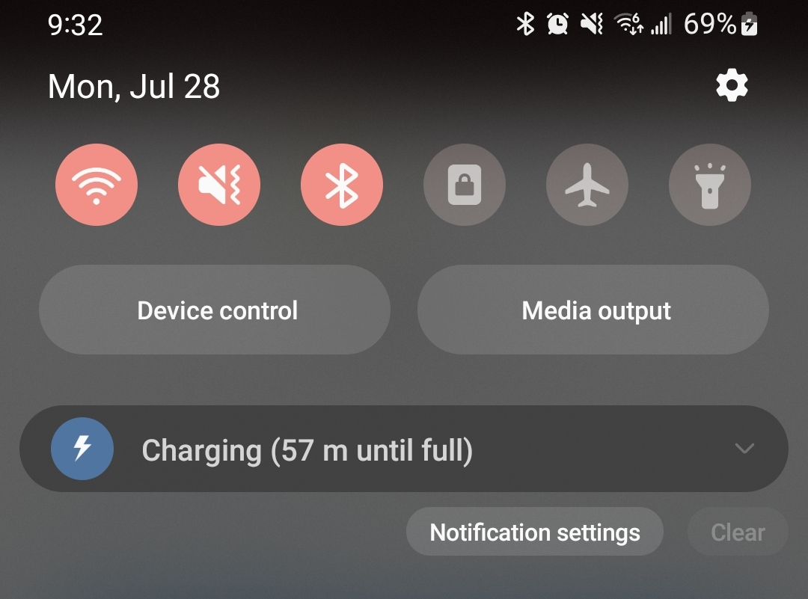

<!-- Header Card -->

  

    <h1 style="margin-bottom: 25px;">Daily Moments of SA</h1>
    
These are small, everyday interactions that illustrate key Situation Awareness principles in action. They help connect abstract SA concepts to familiar experiences.

  

<!-- 57 Minutes Until Full Card -->

  <h3 style="margin-bottom: 15px;">📱 “57 Minutes Until Full”</h3>
  
<strong>Principle:</strong> Present SA Level 2 Information Directly – Support Comprehension

  

    Rather than displaying voltage or just a battery percentage, the phone gives you the information that matters: 
    
    <strong>How long until full?</strong>
  

    

    
  

  

    This is Level 2 SA: Comprehension. It reduces the mental effort needed to interpret raw data and helps you plan your day quickly.
  

  

    <strong>→ Imagine if a process dashboard did the same.</strong>
  

<!-- Road Hazard Ahead Card -->

  <h3 style="margin-bottom: 15px;">🚗 “Object on Road Ahead”</h3>
  
<strong>Principle:</strong> Provide Assistance for Level 3 SA – Support Projection

  

    Modern GPS systems don’t just show your route. They warn you of possible hazards ahead — an object in the road, or even a police car reported by other drivers. 
    
    This forward-looking cue changes how you drive: you might adjust speed, watch nearby lanes, and stay alert for sudden maneuvers. If the hazard is gone, you can even update the system for others.
  

    

    
  

  

    This is Level 3 SA: Projection. The display gives you a picture of what <em>might</em> happen ahead, so you can prepare before it becomes urgent.
  

  

    <strong>→ Imagine if a process dashboard did the same — alerting you to what’s likely to happen next, so you can adjust process parameters proactively and avoid reacting too late, causing issues and inefficiencies.</strong>
  

