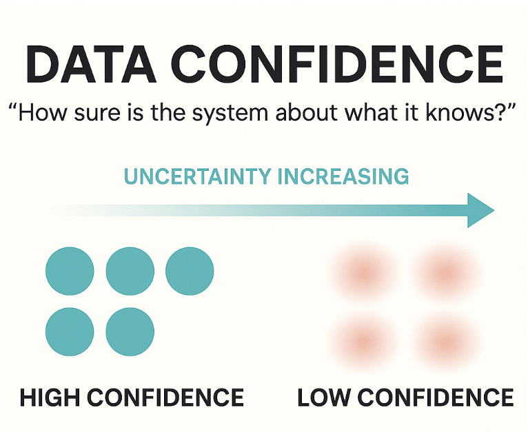
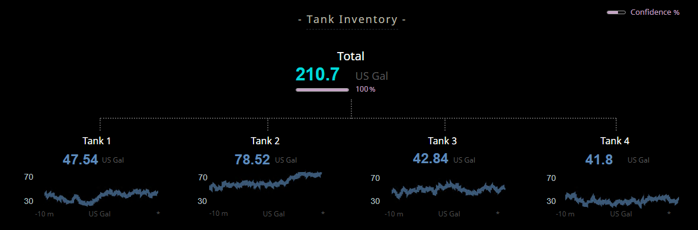
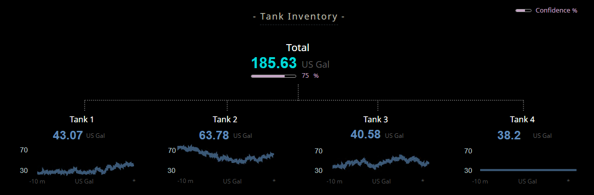
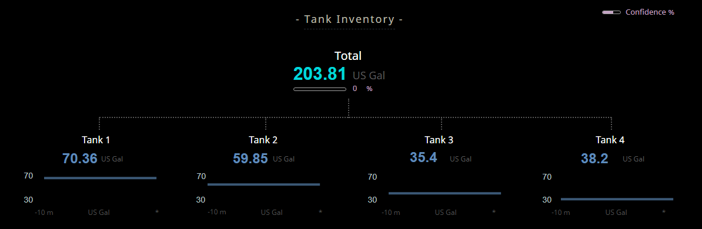
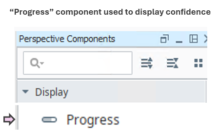
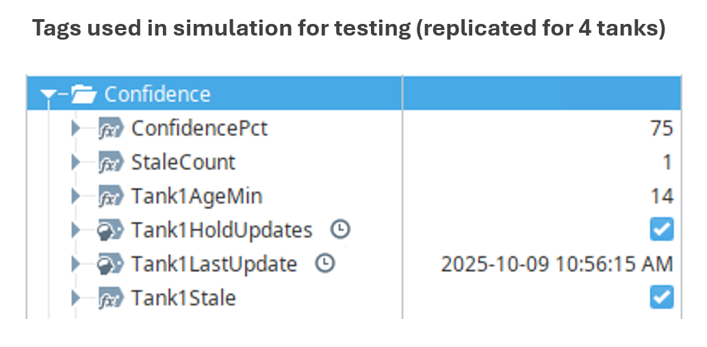

  
  

    Supports Perception & Comprehension
  

  <em>Note: “Data Confidence” represents one form of data uncertainty.  
  At a later stage, this concept will be merged into a new <strong>Uncertainty Representation</strong></a> SA Concept, to provide a more integrated description of information reliability.</em>

### Why It Matters

> **Data Confidence** helps operators assess how much trust to place in the displayed information — especially when that information is **calculated or computed** from multiple inputs.

- Calculated values often depend on several sensor readings or data sources.  
- If one input is stale, missing, or unreliable, the calculated result may no longer represent reality.  
- Providing a clear sense of confidence allows users to **balance trust and verification**, rather than assuming all data is equally reliable.  
- When confidence is visible, users can act with awareness — not assumption.

  

    <em>Related to Endsley’s Principle 13: “Support Assessment of Confidence in Composite Data.”</em>
  

### Operational Impact Examples

- **Calculated totals:**  
  Confidence in computed values (like *total tank volume* or *total downtime*) helps users gauge whether inputs were **valid, synchronized, and complete**.  

- **Model-based estimates:**  
  When displayed data blends measured and predicted inputs, a confidence score clarifies **how much reflects actual readings versus modeled assumptions**.  

- **Averaged readings:**  
  When several sensors feed an average, confidence should decrease if one goes stale or off-scale, signaling potential **distortion of the calculated result**.  

> Confidence displays don’t just show what the system *knows* —  
> they reveal *how sure* it is about what it knows.

### Cross-Domain Analogy

> **Weather Forecasting:**  
> Meteorologists don’t just predict that rain *will* or *won’t* occur — they communicate a probability (“70 % chance of rain”).  
> Likewise, operators benefit when calculated data conveys its **degree of certainty**, not a binary “true/false” impression.

  

### Typical Design Techniques

- **Confidence bars or shading:** Visually represent reliability beneath or beside a calculated value.  
- **Numerical confidence score (%):** Provide a direct readout of certainty for computed results.  
- **Symbolic cues:** Use icons (✓ / ⚠ / ?) or color states (green → amber → red) to express trust level.  
- **Contextual links:** Allow drill-down to see *which input sources* are lowering confidence.

These techniques help users quickly judge the **trustworthiness of calculated data**, not merely observe its magnitude.

### Use Case for Platform Testing

Consider a dashboard that calculates **Total Volume** from four tanks:

- Each tank reports its level and timestamp.  
- When a tank’s data becomes stale or invalid, its weight in the total confidence decreases.  
- A **confidence bar** below the total shows the aggregate reliability (0–100 %), allowing quick visual judgment of the overall data quality.

Evaluate how well the platform helps users *see reliability at a glance* — can they immediately sense when a calculated value might not represent reality?

### Tested Platforms

#### ✅ Ignition Perspective — Supports Confidence Representation

| Aspect | Notes |
| ------ | ----- |
| **Implementation Approach** | Four simulated tanks produce random volume values with adjustable staleness. Each tank’s update age feeds into a decaying confidence model that determines the reliability of the total. |
| **Display Build** | • Confidence bar below total dynamically adjusts from 100 → 0 % as inputs age  • Hold switches allow simulated stale conditions for testing |
| **Version Tested** | Ignition 8.1.x (Perspective) |

  
  
  
  
  

#### ✅ Tatsoft FrameworX — Supports Confidence Representation

| Aspect | Notes |
| ------ | ----- |
| **Implementation Approach** | Four simulated tanks generate random level values within a configurable range. Each tank includes a *Hold Updates* toggle that pauses data changes, allowing its **Age (min)** to increase. A decaying confidence function reduces reliability as the age approaches a configurable threshold (`Conf_StaleAfterMin`). |
| **Display Build** | • Real-time simulation script built in a **Periodic Task** updates tank levels and confidence values. • Each tank includes an individual confidence percentage and a *Hold* switch to simulate stale data. • A **Total Confidence Bar** dynamically adjusts from 100 → 0 % based on the average of all active tanks. • Once a tank exceeds its staleness threshold, its `Tank#Stale` flag activates and the total confidence drops proportionally. |
| **Version Tested** | 10.0.1.464 |

  
  
  
  
  

#### Upcoming Vendor Testing

- TBD 

Explore how other platforms handle uncertainty and freshness in the <a href="../platform-support/sa-vendor-listing" style="text-decoration: none;">SA Vendor Listing</a>.

