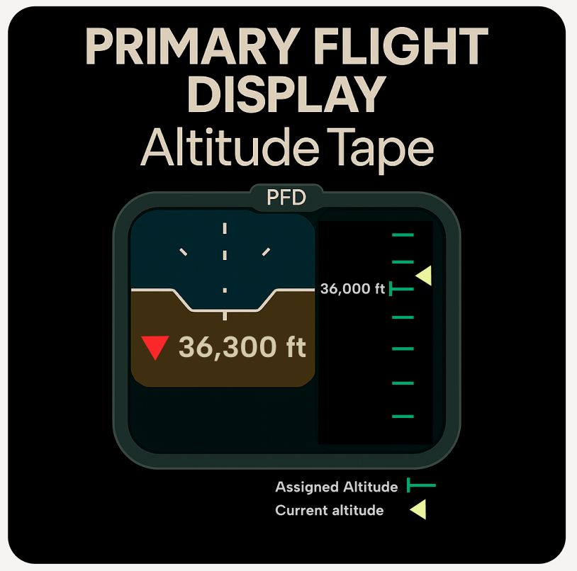

  
  

    SA Level 2 — Comprehension
  

### Why It Matters

- Operators must constantly judge whether current values are acceptable.
- Deviations from expected values signal something might be wrong — but only if noticed.
- Subtle changes can go undetected if visualizations don’t highlight the deviation clearly.
- Knowing how far and how long a process has been off-target is essential for root cause analysis and proactive intervention.

### Operational Impact Examples

- **Lab results outside of spec:**  
  Off-spec lab results (e.g., brightness, pH, or viscosity) may go unnoticed when buried in logs or spreadsheets. Highlighting the deviation from specification — along with time of sample and area affected — enables faster investigation and reduces the risk of recurring quality issues.

- **Process centerline deviation monitoring:**  
  In Pulp and Paper plants, parameters like RPM or chemical strength are tracked against centerline limits. The dashboard highlights how far and how long values have deviated, enabling early action to prevent quality issues, waste, or equipment stress.

- **Pump performance vs. design curve:**  
  Flow and pressure deviate from expected performance curve, signaling impeller wear or blockage.

### Typical Design Techniques

- **Display actual vs. target values clearly:**  
  Include numerical deltas or directional arrows.

- **Highlight how far and for how long a value has been off target:**  
  Use trend lines, timers, or markers.

- **Use color, shape, or motion:**  
  Indicate deviation direction and severity at a glance.

- **Leverage bullet graphs:**  
  Show the degree of variance from plan, setpoint, or expected value.

- **Trend deviation over time:**  
  Not just current readings — visualize the trajectory.

- **Show operating limits visually:**  
  Use bands in trends, bar fills, or process objects like tanks.

- **Compare against design or performance curves:**  
  Such as expected pump or compressor behavior.

> Some of these techniques are also demonstrated in the platform testing section below and may serve as visual examples.

### Real-World Analogy

> **Primary Flight Display Altitude Tape:**  
> In aviation, pilots rely on a visual showing both current altitude and the assigned target altitude. This comparison allows instant recognition of how far off the aircraft is from the intended level.  
>  
> Similarly, dashboards should make deviation just as visible — including how far off the process is and for how long.

  

### Use Case for Platform Testing

Consider a display for operators that helps visually identify when a process is out of bounds or non-compliant:

- Show actual vs. target values with deviation deltas.
- Visually emphasize how far and how long values have been off target.
- Use color or shape to make deviation direction and severity obvious.
- Use bar charts to clearly show variance from plan or expected value.
- Trend deviation over time, not just the raw value.
- Display applicable limits in trends, bars (e.g., tanks), or other objects.

### Tested Platforms

> Testing is currently in progress to evaluate how different platforms support the expression of deviation-aware design techniques.

<ul>
  <li>AVEVA PI Vision</li>
  <li>Ignition Perspective</li>
  <li>FrameworX</li>
</ul>

See which platforms have been tested for each SA principle in the <a href="../platform-support/sa-vendor-listing" style="text-decoration: none;">SA Vendor Listing</a>.

