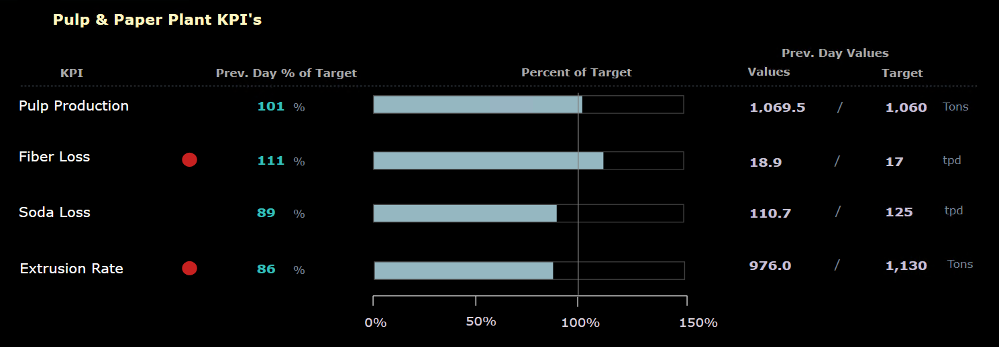
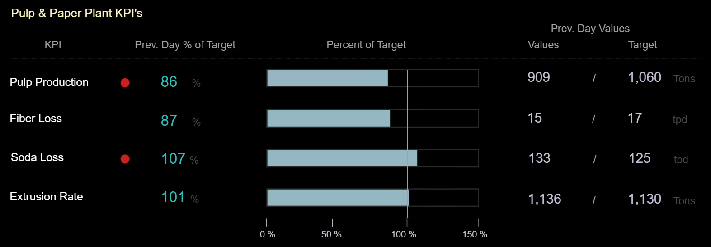

<!-- Hero Infographic -->

  
  

    Supports Comprehension
  

<!-- Why It Matters -->

  

    <h3>Why It Matters</h3>
    <ul style="max-width:none;">
      <li>Operators must constantly judge whether current values are acceptable.</li>
      <li>Deviations from expected values signal something might be wrong — but only if noticed.</li>
      <li>Subtle changes can go undetected if visualizations don’t highlight the deviation clearly.</li>
      <li>Knowing how far and how long a process has been off-target is essential for root cause analysis and proactive intervention.</li>
    </ul>
  

<!-- Operational Impact Examples -->

  

    <h3>Operational Impact Examples</h3>
    <ul style="max-width:none;">
      <li><strong>Lab results outside of spec:</strong> Off-spec lab results (e.g., brightness, pH, or viscosity) may go unnoticed when buried in logs or spreadsheets. Highlighting the deviation from specification — along with time of sample and area affected — enables faster investigation and reduces the risk of recurring quality issues.</li>
      <li><strong>Process centerline deviation monitoring:</strong> In Pulp and Paper plants, parameters like RPM or chemical strength are tracked against centerline limits. The dashboard highlights how far and how long values have deviated, enabling early action to prevent quality issues, waste, or equipment stress.</li>
      <li><strong>Pump performance vs. design curve:</strong> Flow and pressure deviate from expected performance curve, signaling impeller wear or blockage.</li>
    </ul>
  

<!-- Cross-Domain Analogy -->

  

    <h3>Cross-Domain Analogy</h3>
    
<strong>Primary Flight Display Altitude Tape:</strong> In aviation, pilots rely on a visual showing both current altitude and the assigned target altitude. This comparison allows instant recognition of how far off the aircraft is from the intended level. Similarly, dashboards should make deviation just as visible — including how far off the process is and for how long.

    

      
    

  

<!-- Typical Design Techniques -->

  

    <h3>Typical Design Techniques</h3>
    <ul style="max-width:none;">
      <li><strong>Graphically display actual vs. target values:</strong> When bars or shapes are used to show how close a measurement is to its target, more can be conveyed in less space — and understood faster — than text alone.</li>
      <li><strong>Include numerical deltas or directional arrows:</strong> Help users quickly spot the size and direction of deviation from the expected value.</li>
      <li><strong>Highlight how far and for how long a value has been off target:</strong> Use trend lines, timers, or markers to show persistence of deviation.</li>
      <li><strong>Use color or shape to signal deviation severity:</strong> Color fills, flags, or angular indicators work well for drawing attention to large gaps.</li>
      <li><strong>Trend deviation over time:</strong> Don’t just show the variable’s absolute value — chart how far it has strayed from target across time.</li>
      <li><strong>Show operating limits visually:</strong> Use bands in trends, bar fills, or process objects like tanks.</li>
      <li><strong>Compare against design or performance curves:</strong> Such as expected pump or compressor behavior.</li>
    </ul>
    
<em>The demonstration in platform section below shows examples of some of these techniques in practice.</em>

  

<!-- Use Case #1 -->

  

    <h3>Use Case for Demonstration in Platform — #1</h3>
    
This use case explores how well a platform can support deviation-aware design for high-level KPIs in a pulp and paper plant.

    
Inspired by Stephen Few’s principle, it focuses on displaying actual vs. target values as horizontal bars to improve clarity and space efficiency. These displays help management quickly assess performance, spot off-target conditions, and prioritize action.

    <ul style="max-width:none;">
      <li>Use percent-of-target bars for pulp production, fiber loss, soda loss, and extrusion rate.</li>
      <li>Show actual and target values for context.</li>
      <li>Use color or shape to flag KPIs outside the desired range.</li>
      <li>Clearly highlight variance from limits or expected performance.</li>
    </ul>
  

<!-- Demostration in Platform — Use Case #1 -->

  <h3>Demostration in Platform — Use Case #1</h3>

  <h4>✅ FrameworX — Demonstration of Deviation (Actual vs. Target)</h4>
  <table style="max-width:none;">
    <tr><th>Aspect</th><th>Notes</th></tr>
    <tr><td><strong>Implementation Approach</strong></td><td>Calculate measurement “Percent of Target” for each KPI and display it visually using bargraphs.</td></tr>
    <tr><td><strong>Display Build</strong></td><td>• Canvas page type used. • Bargraph fill controlled via analytics tag. • Alert circle visibility triggered by deviation threshold logic.</td></tr>
    <tr><td><strong>Version Used</strong></td><td>10.0.1.464</td></tr>
  </table>

  

    
    
    
  

  <h4>✅ Ignition Perspective — Demonstration of Deviation (Actual vs. Target)</h4>
  <table style="max-width:none;">
    <tr><th>Aspect</th><th>Notes</th></tr>
    <tr><td><strong>Implementation Approach</strong></td><td>“Percent of Target” is calculated in a gateway timer script, simulating process values and computing percent deviation.</td></tr>
    <tr><td><strong>Display Build</strong></td><td>• Progress Bars used for percent-of-target bars in Perspective. • Values and % shown via bound labels. • Color and position set via tag bindings and property transforms.</td></tr>
    <tr><td><strong>Version Used</strong></td><td>Ignition 8.1.x (Perspective)</td></tr>
  </table>

  

    
    
    
  

  <h4>✅ AVEVA PI Vision — Demonstration of Deviation (Actual vs. Target)</h4>
  <table style="max-width:none;">
    <tr><th>Aspect</th><th>Notes</th></tr>
    <tr><td><strong>Implementation Approach</strong></td><td>PI AF Analytics used to calculate simulated KPI values, percent-of-target, and alarm triggers.</td></tr>
    <tr><td><strong>Display Build</strong></td><td>• “Horizontal Gauge” used for percent-of-target bars in PI Vision. • All values are displayed via the “Value” tool. • Alarm circles are visible/hidden using the “Multi-State” feature.</td></tr>
    <tr><td><strong>Version Used</strong></td><td>PI Vision 2024. PI Server 2018 SP3</td></tr>
  </table>

  

    
    
    
  

<!-- Use Case #2 -->

  

    <h3>Use Case for Demonstration in Platform — #2</h3>
    
This use case explores how well a platform can support deviation-aware design by tracking when a process variable moves outside of acceptable limits — and for how long.

    
Unlike Use Case #1, which focuses on magnitude of deviation from a target, this one focuses on time-based deviation detection and display. The design shows how far the process has drifted and for how long it's been out of bounds.

    <ul style="max-width:none;">
      <li>Show how long the value has been out of limits, not just that it <em>is</em>.</li>
      <li>Use visual markers or annotations to display the moment deviation began.</li>
      <li>Include dynamic duration counters to support timely operator action.</li>
      <li>(Optional) Use warning markers for immediate visual indication.</li>
    </ul>
  

<!-- Demostration in Platform — Use Case #2 -->

  <h3>Demostration in Platform — Use Case #2</h3>

  <h4>✅ FrameworX — Demonstration of Deviation (Duration + Limits)</h4>
  <table style="max-width:none;">
    <tr><th>Aspect</th><th>Notes</th></tr>
    <tr><td><strong>Implementation Approach</strong></td><td>Runtime script tracks compliance against Hi/Lo limits and sets a timestamp when values go out of range. A duration timer then tracks how long the value remains out of spec.</td></tr>
    <tr><td><strong>Display Build</strong></td><td>• Canvas display. • Warning markers appear automatically when values exceed limits. • Duration and out-of-limit timestamp shown in real time.</td></tr>
    <tr><td><strong>Version Used</strong></td><td>10.0.1.464</td></tr>
  </table>

  

    
    
    
    
  

  <h4>✅ Ignition Perspective — Demonstration of Deviation (Duration + Limits)</h4>
  <table style="max-width:none;">
    <tr><th>Aspect</th><th>Notes</th></tr>
    <tr><td><strong>Implementation Approach</strong></td><td>Gateway timer script monitors compliance bit and triggers logic to calculate and display deviation duration and timestamp.</td></tr>
    <tr><td><strong>Display Build</strong></td><td>• Time Series Chart shows value, high/low limits. • Timer and timestamp appear when limit exceeded. • Transform and bindings used to format display.</td></tr>
    <tr><td><strong>Version Used</strong></td><td>Ignition 8.1.x (Perspective)</td></tr>
  </table>

  

    
    
    
    
  

  <h4>✅ AVEVA PI Vision — Demonstration of Deviation (Duration + Limits)</h4>
  <table style="max-width:none;">
    <tr><th>Aspect</th><th>Notes</th></tr>
    <tr><td><strong>Implementation Approach</strong></td><td>AF Analysis monitors compliance against Hi/Lo limits. When values exceed limits, a timestamp is recorded. A duration timer tracks how long the value remains out of spec.</td></tr>
    <tr><td><strong>Display Build</strong></td><td>• A “Trend” object shows the value along with high/low limits. • “Timestamp” and “duration” display when limits are exceeded. • “Calculations” in PI Vision used to support visualization logic. • “Multi-State” applied to control visibility based on range conditions.</td></tr>
    <tr><td><strong>Version Used</strong></td><td>PI Vision 2024, PI Server 2018 SP3</td></tr>
  </table>

  

    
    
    
    
  

<!-- Footer -->

  See which platforms have been used to demonstrate each SA concept in the 
  <a href="../platform-support/sa-vendor-listing" style="text-decoration:none;">SA Vendor Listing</a>.

