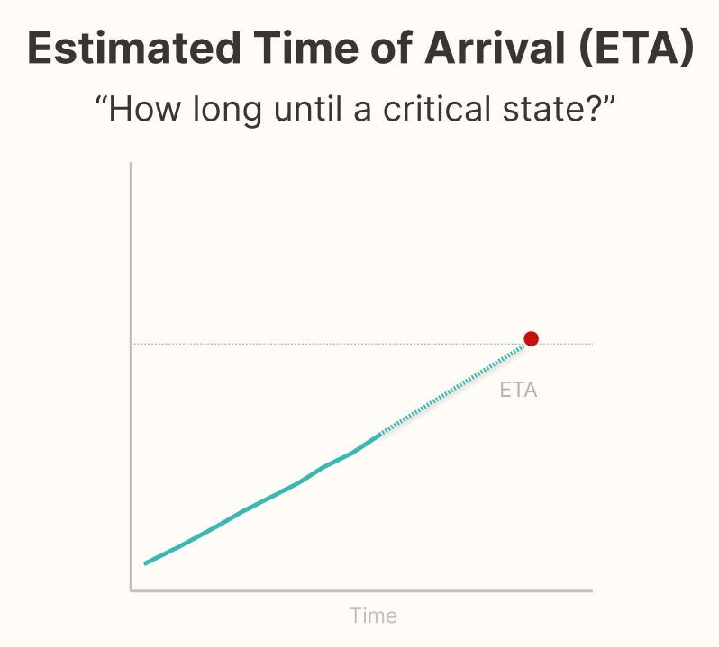
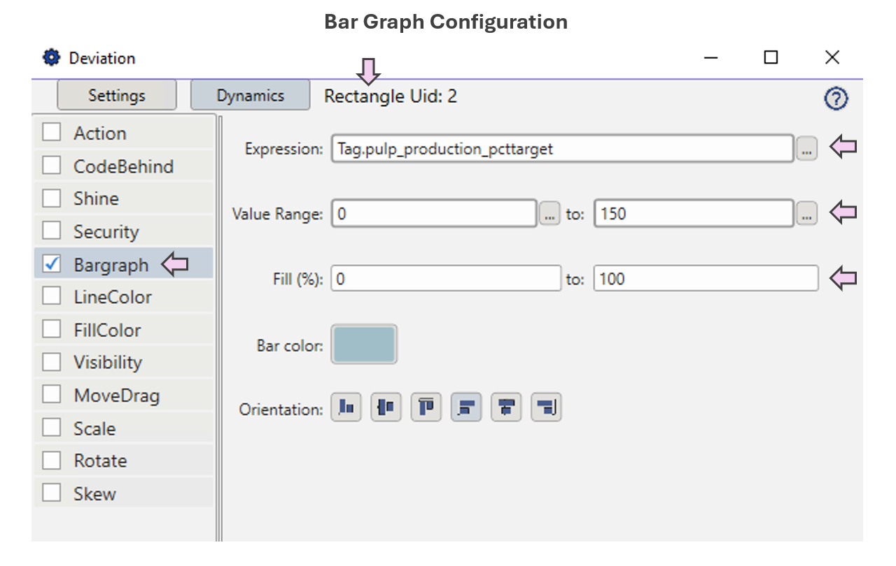
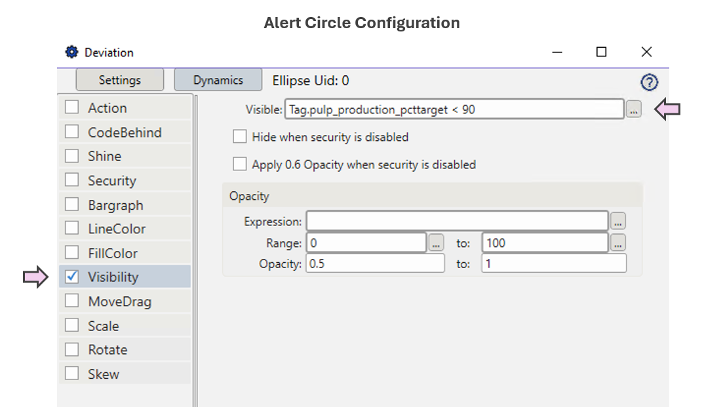

  
  

    SA Level 2 — Comprehension
  

### Why It Matters

- Operators must constantly judge whether current values are acceptable.
- Deviations from expected values signal something might be wrong — but only if noticed.
- Subtle changes can go undetected if visualizations don’t highlight the deviation clearly.
- Knowing how far and how long a process has been off-target is essential for root cause analysis and proactive intervention.

### Operational Impact Examples

- **Lab results outside of spec:**  
  Off-spec lab results (e.g., brightness, pH, or viscosity) may go unnoticed when buried in logs or spreadsheets. Highlighting the deviation from specification — along with time of sample and area affected — enables faster investigation and reduces the risk of recurring quality issues.

- **Process centerline deviation monitoring:**  
  In Pulp and Paper plants, parameters like RPM or chemical strength are tracked against centerline limits. The dashboard highlights how far and how long values have deviated, enabling early action to prevent quality issues, waste, or equipment stress.

- **Pump performance vs. design curve:**  
  Flow and pressure deviate from expected performance curve, signaling impeller wear or blockage.

### Real-World Analogy

> **Primary Flight Display Altitude Tape:**  
> In aviation, pilots rely on a visual showing both current altitude and the assigned target altitude. This comparison allows instant recognition of how far off the aircraft is from the intended level.  
>  
> Similarly, dashboards should make deviation just as visible — including how far off the process is and for how long.

  

### Typical Design Techniques

- **Graphically display actual vs. target values:**  
  When bars or shapes are used to show how close a measurement is to its target, more can be conveyed in less space — and understood faster — than text alone.

- **Include numerical deltas or directional arrows:**  
  Help users quickly spot the size and direction of deviation from the expected value.

- **Highlight how far and for how long a value has been off target:**  
  Use trend lines, timers, or markers to show persistence of deviation.

- **Use color or shape to signal deviation severity:**  
  Color fills, flags, or angular indicators work well for drawing attention to large gaps.

- **Trend deviation over time:**  
  Don’t just show the variable’s absolute value — chart how far it has strayed from target across time.

- **Show operating limits visually:**  
  Use bands in trends, bar fills, or process objects like tanks.

- **Compare against design or performance curves:**  
  Such as expected pump or compressor behavior.

> The platform testing section below shows examples of some of these techniques in practice.

### Use Case for Platform Testing — #1

This use case explores how well a platform can support deviation-aware design for high-level KPIs in a pulp and paper plant.

Inspired by Stephen Few’s principle, it focuses on displaying actual vs. target values as horizontal bars to improve clarity and space efficiency. These displays help management quickly assess performance, spot off-target conditions, and prioritize action.

- Use percent-of-target bars for pulp production, fiber loss, soda loss, and extrusion rate.
- Show actual and target values for context.
- Use color or shape to flag KPIs outside the desired range.
- Clearly highlight variance from limits or expected performance.

### Tested Platforms — Use Case #1

#### ✅ FrameworX — Supports Deviation (Actual vs. Target)
  
| Aspect | Notes |
| ------ | ----- |
| **Implementation Approach** | Calculate measurement "Percent of Target" for each KPI and display it visually using bargraphs. |
| **Display Build** | • Canvas page type used. • Bargraph fill controlled via analytics tag. • Alert circle visibility triggered by deviation threshold logic. |
| **Version Tested** | 10.0.1.464 |

  
  
  

#### Upcoming Vendor Testing

- Inductive Automation Ignition

See which platforms have been tested for each SA principle in the <a href="../platform-support/sa-vendor-listing" style="text-decoration: none;">SA Vendor Listing</a>.

