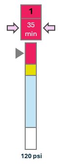
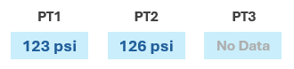

<!-- Header Card -->

  

    <h1 style="margin-bottom: 25px;">SA Bits</h1>
    

      Short, evidence-based notes that connect human cognitive research to practical dashboard design. 
      Each card includes a clear takeaway you can apply immediately.
    

  

<!-- Alarm Duration Card -->

  

  <h3 style="margin-bottom: 15px;">
    <a href="#sec-alarm-duration" style="text-decoration: none; color: inherit;">⏱️ Alarm Duration Affects Perceived Validity</a>
  </h3>

  

    <strong>SA Bit:</strong> Longer-lasting alarms are perceived as more valid, and people are more likely to respond to them.
  

  

    <strong>Design takeaway:</strong> When displaying an alarm, consider showing how long it has been active.
  

  

    <figure style="width:85%; margin:0 auto; text-align:center;">
      
      <figcaption style="font-size:0.75em; color:#999; margin-top:6px;">Vertical gauge showing pressure in priority 1 alarm state as well as alarm duration</figcaption>
    </figure>
  

  

    <em>Why it matters:</em> Duration adds context. It helps users distinguish a brief blip from a persistent condition worth acting on.
  

  

    
      <em>Reference:</em> Endsley &amp; Jones
    
  

<!-- Missing Information Card -->

  

  <h3 style="margin-bottom: 15px;">
    <a href="#sec-missing-information" style="text-decoration: none; color: inherit;">❓ Missing Information Is Not Neutral</a>
  </h3>

  

    <strong>SA Bit:</strong> When information is missing, people often assume it agrees with the information that is present.
  

  

    <strong>Design takeaway:</strong> Explicitly identify missing data rather than leaving gaps that users may interpret as normal or consistent with the rest of the display.
  

  

    <figure style="width:85%; margin:0 auto; text-align:center;">
      
      <figcaption style="font-size:0.75em; color:#999; margin-top:6px;">
        Missing data explicitly identified rather than left blank
      </figcaption>
    </figure>
  

  

    <em>Why it matters:</em> Missing information is often interpreted as agreement with the information that is available. Research by Bolstad and Endsley found that when one of three sensors was missing, participants tended to assume its value matched the other two sensors, even though the missing sensor could have been reporting a conflicting condition.
  

  

    
      <em>Reference:</em> Bolstad &amp; Endsley (1999a); Endsley &amp; Jones
    
  

