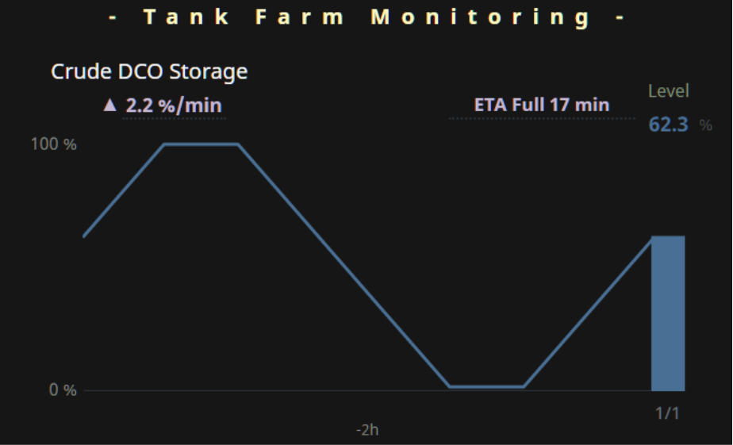
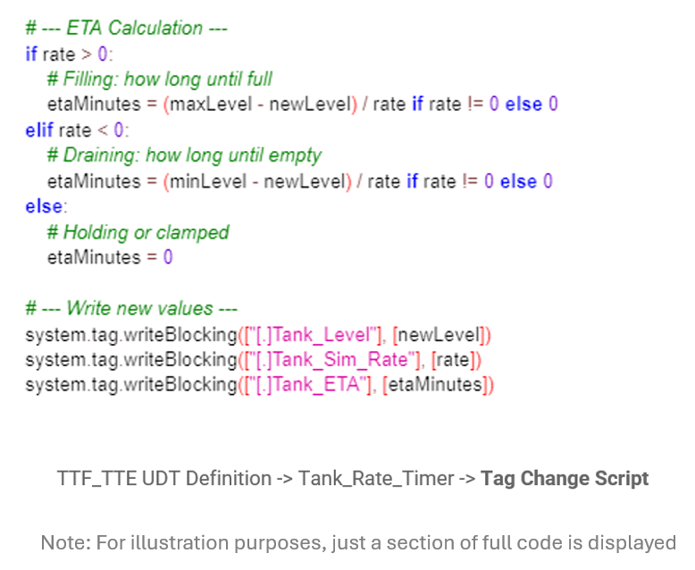

<!-- Hero -->

  
  

    Supports Projection
  

<!-- Why It Matters -->

  

    <h3>Why It Matters</h3>
    <ul style="max-width:none;">
      <li>Operators make better decisions when they know <strong>how long until</strong> a critical state occurs — not just the current value.</li>
      <li>A clear <strong>ETA to full/empty</strong> shifts thinking from reaction to <strong>planning</strong> (e.g., schedule a swap, stage an operator, throttle a valve).</li>
      <li>Expressing the projection directly reduces mental math and avoids the <strong>requisite memory trap</strong> of remembering past levels and doing rate math on the fly.</li>
    </ul>
  

<!-- Operational Impact Examples -->

  

    <h3>Operational Impact Examples</h3>
    <ul style="max-width:none;">
      <li><strong>Transfer line to surge tank:</strong> “ETA Full: 17 min” prompts a controlled setpoint reduction vs. a last-minute scramble.</li>
      <li><strong>Truck unloading bay:</strong> “ETA Empty: 9 min” lets logistics call the next truck and avoid idle time.</li>
      <li><strong>Batch step with feed ramp:</strong> An increasing ETA flags a drift in actual feed rate before limits are breached.</li>
    </ul>
    
<em>Presenting ETA directly improves coordination and timing — two levers that often cost nothing but save hours.</em>

  

<!-- Cross-Domain Analogy -->

  

    <h3>Cross-Domain Analogy</h3>
    
<strong>GPS Arrival Time:</strong> Navigation apps don’t just show distance — they show <strong>ETA</strong> and keep it updated as your speed changes. Operators benefit from the same pattern: surface <strong>how long until</strong> a state change at the current rate.

    

      
    

  

<!-- Typical Design Techniques -->

  

    <h3>Typical Design Techniques</h3>
    <ul style="max-width:none;">
      <li><strong>Direct ETA readout:</strong> “ETA Full: 39 min” / “ETA Empty: 12 min.”</li>
      <li><strong>Smoothing of rate:</strong> Light EMA or rolling slope to avoid flicker; suppress ETA when <code>|rate|</code> is below a threshold.</li>
      <li><strong>Context-aware units:</strong> Rate of change expressed as percent or other process engineering units (%/min, gal/min, L/min, in/min).</li>
      <li><strong>Boundary handling:</strong> When near min/max, show “—” or “At Full/Empty” instead of unstable ETAs.</li>
    </ul>
  

<!-- Use Case -->

  

    <h3>Use Case for Demonstration in Platform</h3>
    
<strong>Goal:</strong> Display <strong>Filling/Draining</strong>, <strong>Rate</strong>, and <strong>ETA</strong> for a tank level using only runtime tags and a lightweight script.

    
<strong>Inputs &amp; outputs:</strong> The calculation uses the current tank level, configurable smoothing, and a minimum rate threshold to determine whether the tank is filling, draining, or stable. It outputs the rate of change, estimated time to full or empty, and a direction indicator, along with clear UI labels showing status, rate, and ETA.

    
<strong>Output Labels Examples:</strong> 
      • ▲ <strong>Filling</strong> at <code>0.5 %/min</code> from 29.8% → <strong>ETA Full:</strong> 2h 16m 
      • ▼ <strong>Draining</strong> at <code>0.7 %/min</code> from 65% → <strong>ETA Empty:</strong> 1h 33m 
      • <strong>Stable</strong> when <code>|rate| &lt; MinRate</code> → ETA shows “—”
    

  

<!-- Platforms Used for Demonstration -->

  <h3>Platforms Used for Demonstration</h3>

  <h4>✅ FrameworX — Demonstration of ETA (Time to Full/Empty)</h4>
  <table style="max-width:none;">
    <tr><th>Aspect</th><th>Notes</th></tr>
    <tr><td><strong>Implementation Approach</strong></td><td>Server script with <code>@Tag</code> reads level, computes smoothed <strong>rate (EMA)</strong> and <strong>ETA</strong>; suppresses ETA when below threshold.</td></tr>
    <tr><td><strong>Display Build</strong></td><td>Three labels bound separately: <strong>Filling/Draining</strong> (arrow Up/Down), <strong>Rate</strong>, <strong>ETA</strong>. Linear simulator drives fills/drains for this demonstration.</td></tr>
    <tr><td><strong>Version Used</strong></td><td>10.0.1.464</td></tr>
  </table>

  

    
    
  

  <h4>✅ Ignition Perspective — Demonstration of ETA (Time to Full/Empty)</h4>
  <table style="max-width:none;">
    <tr><th>Aspect</th><th>Notes</th></tr>
    <tr><td><strong>Implementation Approach</strong></td><td>Gateway Timer Script reads level/min/max and tuner tags, computes smoothed <strong>rate (EMA)</strong> and <strong>ETA</strong>; suppresses ETA when rate is below threshold. Writes results to memory tags (<strong>Rate</strong>, <strong>Direction</strong>, <strong>ETA</strong>, label strings).</td></tr>
    <tr><td><strong>Display Build</strong></td><td>Three labels bound separately: <strong>Filling/Draining/Stable</strong> (↑/↓/—), <strong>Rate</strong> (e.g., <code>0.8 %/min</code>), <strong>ETA</strong> (e.g., <code>ETA Empty: 70 min</code> or <code>—</code>). Simple tag-driven simulator used to drive fill/drain for this demonstration.</td></tr>
    <tr><td><strong>Version Used</strong></td><td>Ignition 8.1.x (Perspective)</td></tr>
  </table>

  

    
    
  

<!-- Footer -->

  See which platforms have been used to demonstrate each SA concept in the 
  <a href="../platform-support/sa-vendor-listing" style="text-decoration:none;">SA Vendor Listing</a>.

