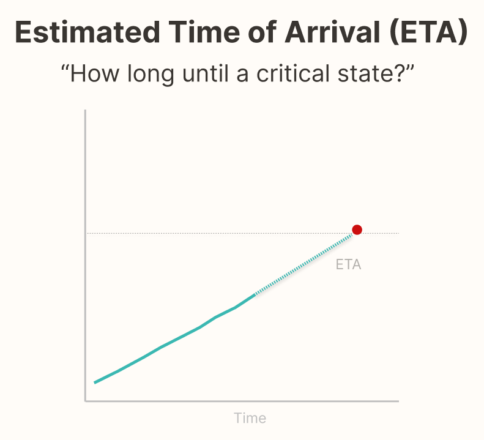
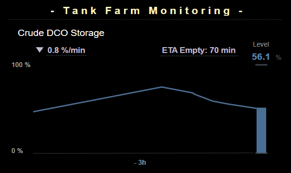
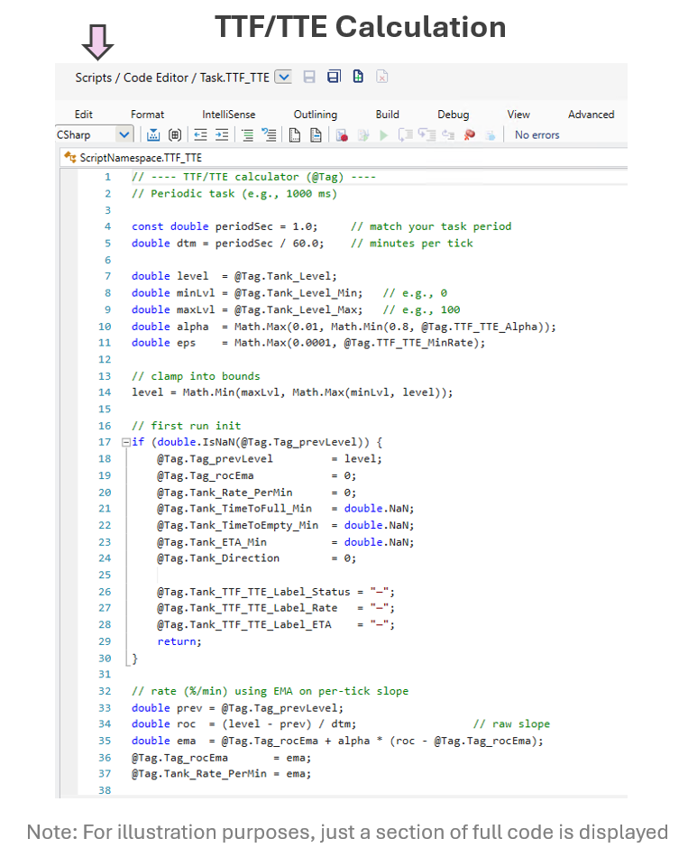

  
  

    Supports Projection
  

### Why It Matters

- Operators make better decisions when they know **how long until** a critical state occurs—not just the current value.
- A clear **ETA to full/empty** shifts thinking from reaction to **planning** (e.g., schedule a swap, stage an operator, throttle a valve).
- Expressing the projection directly reduces mental math and avoids the **requisite memory trap** of remembering past levels and doing rate math on the fly.

### Operational Impact Examples

- **Transfer line to surge tank:**  
  “ETA Full: 17 min” prompts a controlled setpoint reduction vs. a last-minute scramble.
- **Truck unloading bay:**  
  “ETA Empty: 9 min” lets logistics call the next truck and avoid idle time.
- **Batch step with feed ramp:**  
  An increasing ETA flags a drift in actual feed rate before limits are breached.

> Presenting ETA directly improves coordination and timing—two levers that often cost nothing but save hours.

### Cross-Domain Analogy

> **GPS Arrival Time:**  
> Navigation apps don’t just show distance—they show **ETA** and keep it updated as your speed changes.  
> Operators benefit from the same pattern: surface **how long until** a state change at the current rate.

  

### Typical Design Techniques

- **Direct ETA readout:** “ETA Full: 39 min” / “ETA Empty: 12 min.”
- **Smoothing of rate:** Light EMA or rolling slope to avoid flicker; suppress ETA when `|rate|` is below a threshold.
- **Context-aware units:** Rate of change expressed as percent or other process engineering units (%/min, gal/min, L/min, in/min).
- **Boundary handling:** When near min/max, show “—” or “At Full/Empty” instead of unstable ETAs.

### Use Case for Platform Testing

**Goal:** Display **Filling/Draining**, **Rate**, and **ETA** for a tank level using only runtime tags and a lightweight script.

**Inputs & outputs:**
The calculation uses the current tank level, configurable smoothing, and a minimum rate threshold to determine whether the tank is filling, draining, or stable. It outputs the rate of change, estimated time to full or empty, and a direction indicator, along with clear UI labels showing status, rate, and ETA.

**Output Labels Examples:**  
- ▲ **Filling** at `0.5 %/min` from 29.8% → **ETA Full:** 2h 16m  
- ▼ **Draining** at `0.7 %/min` from 65% → **ETA Empty:** 1h 33m  
- **Stable** when `|rate| < MinRate` → ETA shows “—”   

### Tested Platforms

#### ✅ FrameworX — Supports ETA (Time to Full/Empty)
  
| Aspect | Notes |
| ------ | ----- |
| **Implementation Approach** | Server script with `@Tag` reads level, computes smoothed **rate (EMA)** and **ETA**; suppresses ETA when below threshold. |
| **Display Build** | Three labels bound separately: **Filling/Draining** (arrow Up/Down), **Rate**, **ETA**. Linear simulator drives fills/drains for testing. |
| **Version Tested** | 10.0.1.464 |

  
  

#### Upcoming Vendor Testing

- Ignition Perspective
- AVEVA PI Vision

Explore the <a href="../platform-support/sa-vendor-listing" style="text-decoration: none;">Clear Picture SA Vendor Matrix</a> to see how different platforms support ETA-aware design techniques.

