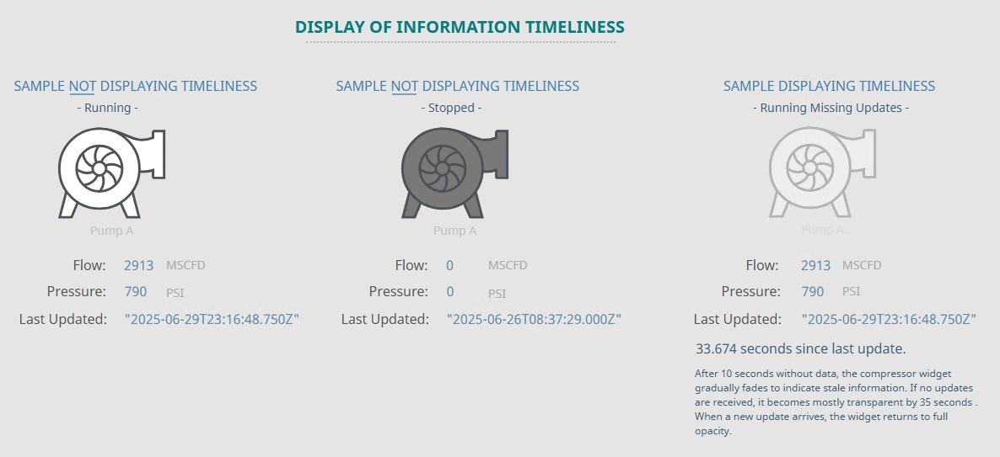

<!-- Hero -->

  
  

    Supports Perception &amp; Comprehension
  

<!-- Note -->

  <em>Note: “Information Timeliness” represents one form of data uncertainty.
  At a later stage, this concept will be merged into a new <strong>Uncertainty Representation</strong> SA Concept, to provide a more integrated description of information reliability.</em>

<!-- Why It Matters -->

  

    <h3>Why It Matters</h3>
    <ul style="max-width:none;">
      <li>In dynamic industrial environments, older data becomes less trustworthy as time passes.</li>
      <li>Operators may not naturally notice missing updates if stale data looks the same as fresh data.</li>
      <li>Subtle time-based visual cues prevent silent degradation of the operator's Situation Awareness.</li>
    </ul>
  

<!-- Operational Impact Examples -->

  

    <h3>Operational Impact Examples</h3>
    <ul style="max-width:none;">
      <li><strong>Missed update in compressor station status:</strong> If a compressor stops and the symbol appears normal, operators may fail to act before pressure rises to unsafe levels.</li>
      <li><strong>Sensor disconnection during a chemical batch process:</strong> Outdated temperature data could give a false impression that a reaction is on track, risking off-spec product or safety issues.</li>
      <li><strong>Outdated flowmeter reading in water treatment:</strong> Operators might assume flow is continuous when it’s not, delaying detection of a blockage or pump failure.</li>
    </ul>
    
<em>Visualizing data aging directly contributes to timely human intervention — a core requirement in process safety and product quality.</em>

  

<!-- Cross-Domain Analogy -->

  

    <h3>Cross-Domain Analogy</h3>
    
<strong>Radar Displays:</strong> In air traffic control, aircraft symbols often dim gradually if no radar sweep refreshes the aircraft’s position, providing an immediate visual cue of data aging.

    

      
    

  

<!-- Typical Design Techniques -->

  

    <h3>Typical Design Techniques</h3>
    <ul style="max-width:none;">
      <li><strong>Fading Opacity:</strong> Visual elements gradually fade as data ages.</li>
      <li><strong>Desaturation:</strong> Colors shift toward grayscale with time since last update.</li>
      <li><strong>Countdown timers:</strong> Textual or graphical age indicators.</li>
      <li><strong>Halo decay:</strong> Glows or edge highlights diminish as time passes.</li>
      <li><strong>Last updated timestamp:</strong> Display of data freshness (less effective for fast visual scan).</li>
    </ul>
  

<!-- Use Case -->

  

    <h3>Use Case for Demonstration in Platform</h3>
    
Consider a pipeline network monitoring dashboard where equipment symbols fade if no update has been received in 5 minutes:

    <ul style="max-width:none;">
      <li>A compressor station icon maintains full color if data is recent.</li>
      <li>If no update arrives after X amount of time, the icon fades toward 80% opacity.</li>
      <li>This immediately signals attention to possible stale or disconnected data.</li>
      <li>Upon receiving a new update, the full opacity is restored automatically.</li>
    </ul>
  

<!-- Platforms Used for Demonstration -->

  <h3>Platforms Used for Demonstration</h3>

  <h4>✅ FrameworX — Demonstration of Information Timeliness</h4>
  <table style="max-width:none;">
    <tr><th>Aspect</th><th>Notes</th></tr>
    <tr><td><strong>Implementation Approach</strong></td><td>Analytics scripting used for simulating data and calculating a linear fade applied to object opacity.</td></tr>
    <tr><td><strong>Display Build</strong></td><td>• Canvas page type used. • Icon opacity dynamically controlled via analytics tag.</td></tr>
    <tr><td><strong>Version Used</strong></td><td>10.0.1.464</td></tr>
  </table>

  

    
    
  

  

  <h4>✅ Ignition Perspective — Demonstration of Information Timeliness</h4>
  <table style="max-width:none;">
    <tr><th>Aspect</th><th>Notes</th></tr>
    <tr><td><strong>Implementation Approach</strong></td><td>Analytics scripting used for simulating data and calculating a linear fade applied to object opacity.</td></tr>
    <tr><td><strong>Display Build</strong></td><td>• Dashboard display component used. • An “opacity” property was added, and an “Expression Binding” script configured to dynamically control opacity.</td></tr>
    <tr><td><strong>Version Used</strong></td><td>Ignition 8.1.x (Perspective)</td></tr>
  </table>

  

    
    
  

  

  <h4>✅ AVEVA PI Vision — Demonstration of Information Timeliness</h4>
  <table style="max-width:none;">
    <tr><th>Aspect</th><th>Notes</th></tr>
    <tr><td><strong>Implementation Approach</strong></td><td>Analytics scripting used for simulating data and calculating the number of seconds since last update (function: <code>SecSinceChange()</code>).</td></tr>
    <tr><td><strong>Display Build</strong></td><td>“Multistate” feature was used to set a color range that emulates opacity fading.</td></tr>
    <tr><td><strong>Version Used</strong></td><td>PI Vision 2024, PI Server 2018 SP3</td></tr>
  </table>

  

    
    
  

  

<!-- Footer -->

  See which platforms have been used to demonstrate each SA concept in the 
  <a href="../platform-support/sa-vendor-listing" style="text-decoration:none;">SA Vendor Listing</a>.

