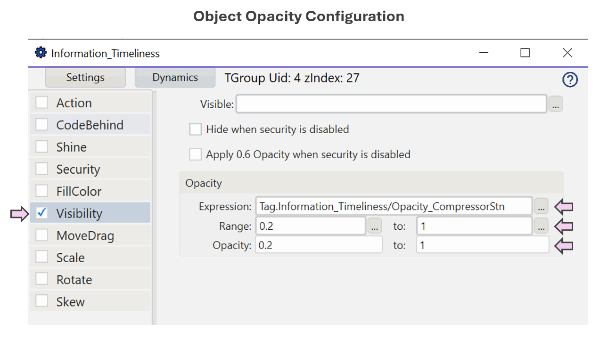

  

### Why It Matters

- In dynamic industrial environments, older data becomes less trustworthy as time passes.
- Operators may not naturally notice missing updates if stale data looks the same as fresh data.
- Subtle time-based visual cues prevent silent degradation of the operator's Situation Awareness.

> As Endsley notes in *Designing for SA*:  
> “Without representation of timeliness, people may fail at the early stages of SA, never progressing to comprehension or projection.”

### Operational Impact Examples

Missed signs of stale data can have real-world consequences:

- A **compressor station** stops reporting data, but appears "normal" on screen. Pressures continue rising downstream unnoticed, risking equipment stress or failure.
- An **alarm system** fails to update, and operators believe an issue has been resolved — when in fact no update has arrived in 10 minutes.
- A **batch process** shows frozen sensor values — leading to delayed intervention, lost product, or safety events.

When operators trust data that is silently outdated, awareness breaks down — and small issues can escalate into serious problems.

### Typical Design Techniques

- **Fading Opacity:** Visual elements gradually fade as data ages.
- **Desaturation:** Colors shift toward grayscale with time since last update.
- **Countdown timers:** Textual or graphical age indicators.
- **Halo decay:** Glows or edge highlights diminish as time passes.
- **Last updated timestamp:** Display of data freshness (less effective for fast visual scan).

### Real-World Analogy

> **Radar Displays:**  
> In air traffic control, aircraft symbols often dim gradually if no radar sweep refreshes the aircraft’s position — providing an immediate visual cue of data aging.

  

### Use Case for Platform Testing

Consider a pipeline network dashboard where equipment symbols fade if no update has been received in 5 minutes:

- A compressor station icon maintains full color if data is recent.
- If no update arrives after X minutes, the icon fades toward 80% opacity.
- This immediately signals possible stale or disconnected data.
- When a new update arrives, full opacity is restored automatically.

### Tested Platforms

#### ✅ FrameworX — Supports Information Timeliness

| Aspect | Notes |
| ------ | ----- |
| **Test Status** | Completed |
| **Implementation Approach** |  • Analytics scripting used for calculating time since last update. • Linear fade calculation applied to object opacity. • Vendor documentation and demo projects consulted for scripting functions. |
| **Display Build** | Canvas page type used. Icon opacity controlled via Analytics tag. |
| **Resulting Visualization** | See screenshots below. |

  
  

#### Upcoming Vendor Testing

- AVEVA PI Vision

Full capability matrix available: [SA Principles Support](../platform-support/sa-principles-support)

