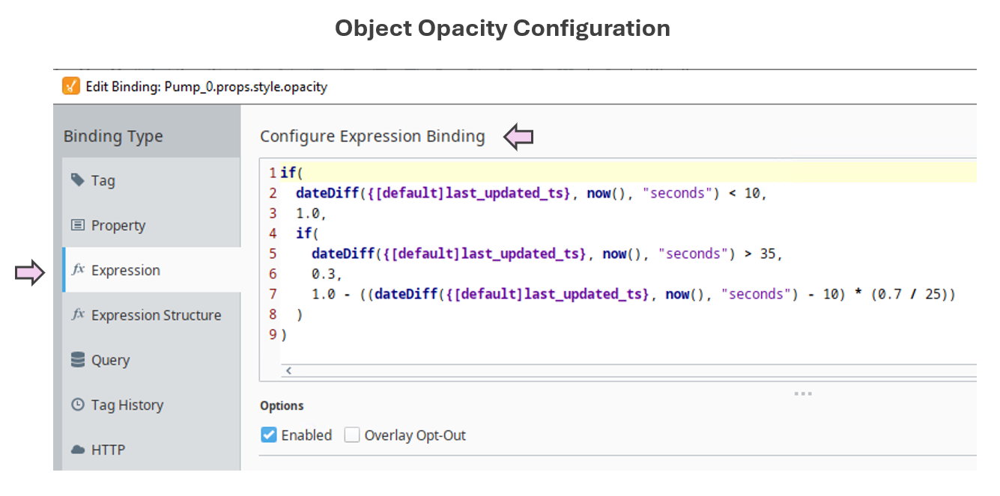

  
  

    Supports Perception & Comprehension
  

  <em>Note: “Information Timeliness” represents one form of data uncertainty.  
  At a later stage, this concept will be merged into a new <strong>Uncertainty Representation</strong></a> SA Concept, to provide a more integrated description of information reliability.</em>

### Why It Matters

- In dynamic industrial environments, older data becomes less trustworthy as time passes.
- Operators may not naturally notice missing updates if stale data looks the same as fresh data.
- Subtle time-based visual cues prevent silent degradation of the operator's Situation Awareness.

### Operational Impact Examples

- **Missed update in compressor station status:**  
  If a compressor stops and the symbol appears normal, operators may fail to act before pressure rises to unsafe levels.

- **Sensor disconnection during a chemical batch process:**  
  Outdated temperature data could give a false impression that a reaction is on track, risking off-spec product or safety issues.

- **Outdated flowmeter reading in water treatment:**  
  Operators might assume flow is continuous when it’s not, delaying detection of a blockage or pump failure.

> Visualizing data aging directly contributes to timely human intervention — a core requirement in process safety and product quality.

### Cross-Domain Analogy

> **Radar Displays:**  
> In air traffic control, aircraft symbols often dim gradually if no radar sweep refreshes the aircraft’s position, providing an immediate visual cue of data aging.

  

### Typical Design Techniques

- **Fading Opacity:** Visual elements gradually fade as data ages.
- **Desaturation:** Colors shift toward grayscale with time since last update.
- **Countdown timers:** Textual or graphical age indicators.
- **Halo decay:** Glows or edge highlights diminish as time passes.
- **Last updated timestamp:** Display of data freshness (less effective for fast visual scan).

### Use Case for Platform Testing

Consider a pipeline network monitoring dashboard where equipment symbols fade if no update has been received in 5 minutes:

- A compressor station icon maintains full color if data is recent.
- If no update arrives after X amount of time, the icon fades toward 80% opacity.
- This immediately signals attention to possible stale or disconnected data.
- Upon receiving a new update, the full opacity is restored automatically.

### Tested Platforms

#### ✅ FrameworX — Supports Information Timeliness
  
| Aspect | Notes |
| ------ | ----- |
| **Implementation Approach** | Analytics scripting used for simulating data and calculating a linear fade applied to object opacity. |
| **Display Build** | • Canvas page type used. • Icon opacity dynamically controlled via analytics tag. |
| **Version Tested** | 10.0.1.464 |

  
  

#### ✅ Ignition Perspective — Supports Information Timeliness
  
| Aspect | Notes |
| ------ | ----- |
| **Implementation Approach** | Analytics scripting used for simulating data and calculating a linear fade applied to object opacity. |
| **Display Build** | • Dashboard display component used. • An "opacity" property was added, and an "Expression Binding" script configured to dynamically control opacity. |
| **Version Tested** | Ignition 8.1.x (Perspective) |

  
  

#### ✅ AVEVA PI Vision — Supports Information Timeliness
  
| Aspect | Notes |
| ------ | ----- |
| **Implementation Approach** | Analytics scripting used for simulating data and calculating the number of seconds since last update (function: "SecSinceChange()"). |
| **Display Build** | "Multistate" feature was used to set a color range that emulates opacity fading.|
| **Version Tested** | PI Vision 2024, PI Server 2018 SP3 |

  
  

#### Upcoming Vendor Testing

- TBD

See which platforms have been tested for each SA concept in the <a href="../platform-support/sa-vendor-listing" style="text-decoration: none;">SA Vendor Listing</a>.

